# 도베인 주도 개발 시작하기 : DDD 핵심 개념 정리부터 구현까지

- 정리 범위
  - Chapter 1 도메인 모델 시작하기 : 1.6 ~ 1.7
  - Chapter 2 아키텍처 개요 :  2.1

## 1.6 엔티티와 밸류

다음 도출한 모델은 크게 엔티티(`entity`)와 밸류(`value`)로 구분할 수 있다.

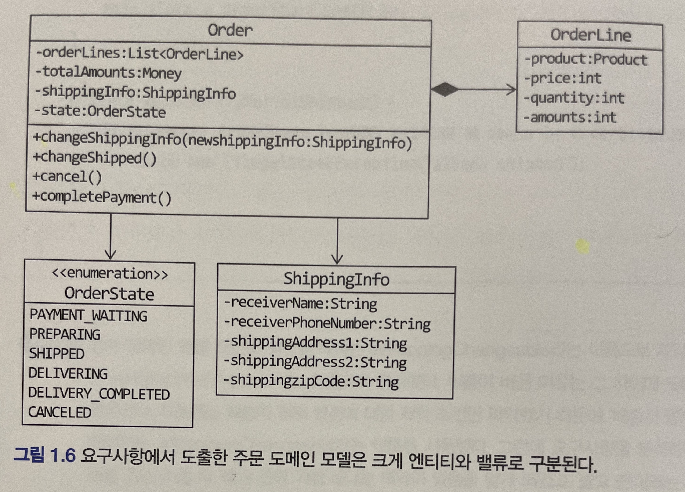

### 1.6.1 엔티티

엔티티 가장 큰 특징은 식별자를 가진다.

- 식별자는 엔티티 객체마다 고유해서 각 엔티티는 서로 다른 식별자를 갖는다.

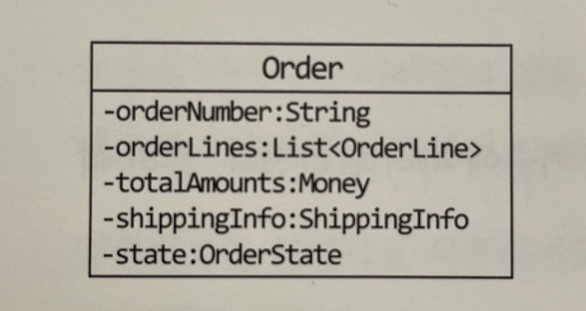

- 주문 엔티티에서는 주문 번호가 고유한 값이다.
- 주문 번호가 주문의 식별자가 된다.

식별자는 엔티티를 생성하고 속성을 바꾸고 삭제할 때까지 유지된다.

- 주문 정보에서 사용자의 배송지를 바꾸거나 주문의 상태가 변경되어도 주문 정보가 변경되지 않는다.

엔티티의 식별자는 바뀌지 않고 고유하기 때문에 두 엔티티 객체의 식별자가 같으면 두 엔티티는 같다고 판단할 수 있다.

#### 정리

- 엔티티의 식별자는 고유한 값이며, 각 엔티티는 고유한 식별자를 갖는다.
- 식별자가 같으면 두 엔티티는 같다고 판단한다.

### 1.6.2 엔티티의 식별자 생성

엔티티의 식별자 생성 방식

- 특정 규칙에 따라 생성
  - 날짜와 시간을 이용해서 식별자 생성
  - ex) 주문 번호의 경우 20211128317280000 또는 001-A882770000
- UUID나 Nano ID와 같은 고유 식별자 생성기 사용
  - 자바의 경우 java.util.UUID 클래스 이용
    
    ```java
    UUID uuid = UUID.randomUUID();

    String strUuid = uuid.toString();
    ```

- 값을 직접 입력
  - 회원의 아이디 또는 이메일
  - 사용자가 직접 입력하는 값이기 때문에 식별자 중복 방지 처리
- 일련번호 사용(시퀀스나 DB의 자동 증가 칼럼 사용)
  - 데이터베이스가 제공하는 자동 증가 기능 사용
  - ex) 오라클의 시퀀스, MySQL의 자동 증가 컬럼

자동 증가 컬럼을 제외한 다른 방식은 식별자를 먼저 만들고 엔티티 객체를 생성할 때 식별자를 전달한다.

```java
String orderNumber = orderRepository.generateOrderNumber();

Order order = new Order(orderNumber, ....);
orderRepository.save(order);
```

자동 증가 컬럼은 DB 테이블에 데이터를 삽입해야 비로소 값을 알 수 있기 때문에 테이블에 데이터를 추가하기 전에는 식별자를 알 수 없다.

- 엔티티 객체를 생성할 떄 식별자를 전달할 수 없다.

```java
Article article = new Article(author, title, ...);
articleRepository.save(article);
Long savedArticleId = article.getId();
```

#### 정리

- 식별자는 비즈니스 요건에 맞춰 생성할 수 있으며, 크게 다음과 생성 가능하다.
  - 특정 규칙에 따라 생성
  - UUID나 Nano ID와 같은 고유 식별자 생성기 사용
  - 값을 직접 입력
  - 일련번호 사용(시퀀스나 DB의 자동 증가 칼럼 사용)

### 1.6.3 밸류 타입

밸류 타입은 개념적으로 완전한 하나를 표현할 때 사용한다.

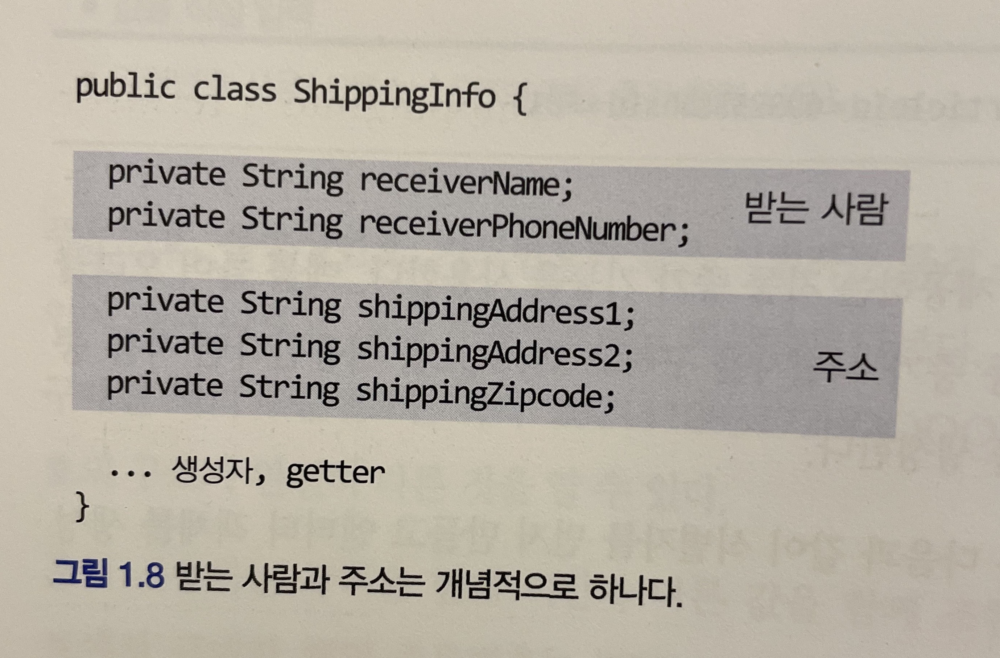

- `receiverName` 필드와 `receiverPhoneNumber` 필드는 서로 다른 두 데이터를 담고 있지만 두 필드는 개념적으로 받는 사람을 의미한다.
- 즉 두 필드는 실제로 하나의 개념을 표현한다.
- 받는 사람을 위한 밸류 타입인 `Receiver` 로 작성할 수 있다.
- 주소 관련 데이터도 `Address` 밸류 타입을 사용해서 보다 명확하게 표현할 수 있다.


- Receiver는 받는 사람을, Address는 주소를 표현한다.

밸류 타입이 꼭 두 개 이상의 데이터를 가져야 하는 것은 아니다. 

- 의미를 명확하게 표현하기 위해 밸류 타입을 사용하는 경우도 있다.

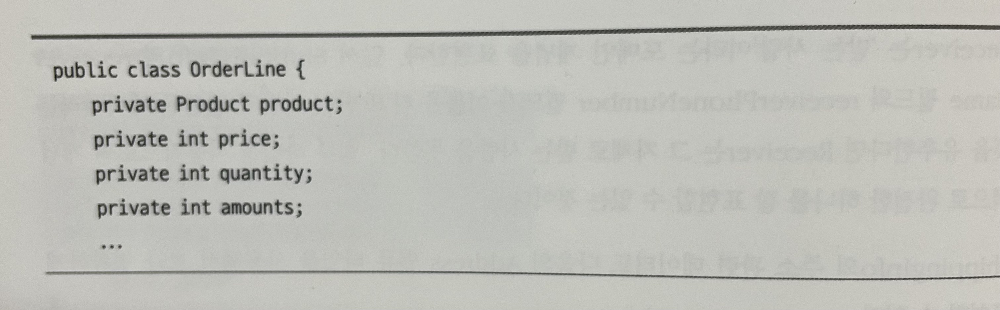

- price와 amounts는 int 타입의 숫자를 사용하고 있지만 이들은 돈을 의미하는 값이다.
- Money 객체를 만들어 사용하면 코드를 이해하는데 도움이 된다.

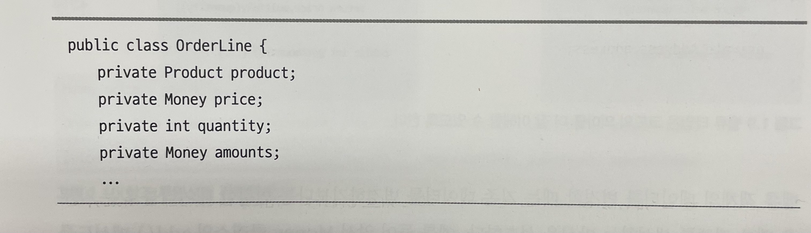

Money 객체를 통해서 돈 계산을 위한 기능을 추가할 수 있다.

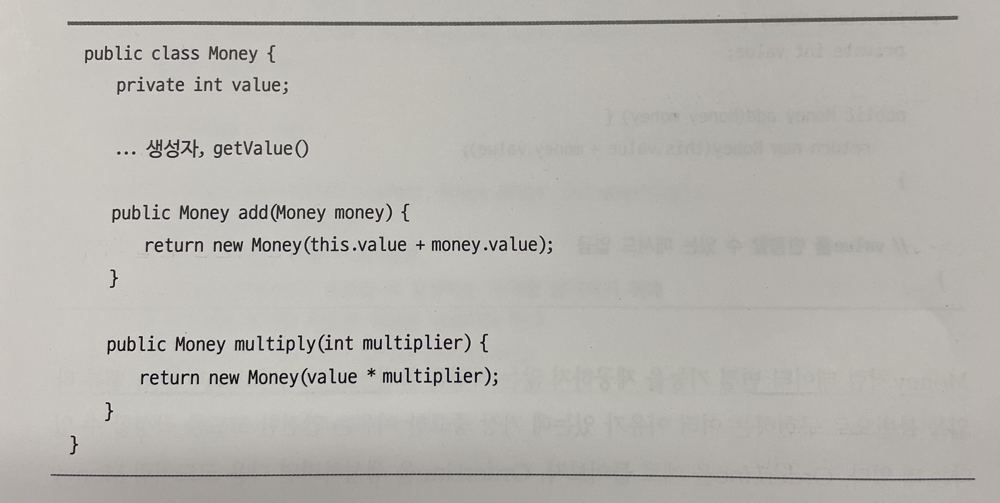

- 정수 타입 게산이 아닌 돈 계산이라는 의미로 이해할 수 있다.

이러한 밸류 타입을 통해서 코드의 의미를 더 잘 이해할 수 있다.

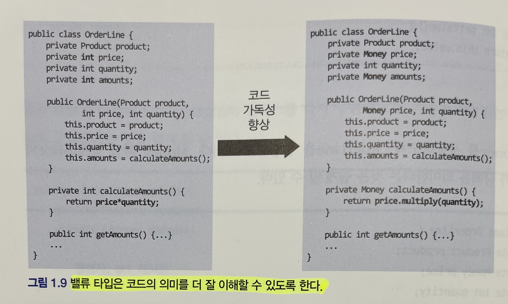

밸류 객체의 데이터를 변경할 때는 기존 데이터를 변경하기보다는 변경한 데이터를 갖는 새로운 벨류 객체를 생성하는 방식을 선호한다.

- 불변 객체를 통해서 안전한 코드를 작성할 수 있다.

밸류 객체를 비교할 때는 모든 속성이 같은지 비교한다.


#### 불변 객체

엘레강트 오브젝트 중

- 불변성의 특징으로는 크기가 작으며, 응집력이 높고, 느슨하게 결합되며, 유지보수하기 쉬운 클래스
- 불변성을 통해 얻고자 하는 부분은 유지보수 -> 이해하기 쉬운 코드가 유지보수하기 쉬움
- 변경 가능한 객체를 만들지 말아야 하며, 항상 불변 객체를 사용해야 한다.
- 불변 객체는 내부의 어떤 것도 수정할 수 없기 때문에 결함이 발생하지 않는다. 대신 새로운 상태를 가진 새로운 객체를 인스턴스화한다.
- 불변성을 활용하면 코드 전반적으로 구문 사이에 존재하는 시간적인 결합을 제거할 수 있다.
- 모든 객체를 불변으로 만들면 객체 안에 NULL을 포함시키는 것이 애초에 불가능해진다. 다시 말해서 작고, 견고하고, 응집도 높은 객체를 생성할 수 밖에 없도록 강제되기 때문에 결과적으로 유지보수하기에 훨씬 더 쉬운 객체를 만든다.
- 불변 객체는 실행 시점에 상태를 수정할 수 없게 금지함으로써 이 문제를 완벽하게 해결한다. 어떤 스레드도 객체의 상태를 수정할 수 없기 때문에 아무리 많은 스레드가 객체에 접근해도 문제가 없다.
- 불변 객체가 작은 이유는 생성자 안에서만 상태를 초기화할 수 있기 때문이다. 불변성은 클래스를 더 깔끔하고 더 짧게 만든다. 진정한 객체지향 소프트웨어는 오직 불변 객체만이 존재해야 한다.

#### 정리

- 밸류 타입은 개념적으로 완전한 하나를 표현한다.
  - 성과 이름을 합친 전체 이름
  - 배송지 정보
  - 핸드폰 번호
- 의미를 명확하게 표현하기 위해 밸류 타입을 사용하는 경우도 있다.
  - int 또는 long 보다는 돈의 의미를 나타내는 Money 객체

### 1.6.4 엔티티 식별자와 밸류 타입

식별자는 단순한 문자열이 아니라 도메인에서 특별한 의미를 지니는 경우가 많기 때문에 식별자를 위한 밸류 타입을 사용해서 의미가 잘 드러나도록 할 수 있다.

- 주문번호를 표현하기 위해 Order의 식별자 타입으로 String 대신 OrderNo의 식별자 타입으로 String 대신 OrderNo 밸류 타입을 사용하면 타입을 통해 해당 필드가 주문번호라는 것을 알 수 있다.
- 필드의 의미가 드러나도록 하려면 `id` 라는 필드 이름 대신 `orderNo` 라는 필드 이름을 사용해야 한다.
  - 실제 엔티티를 만들 때, 엔티티가 `Order` 라면 필드 이름은 `order` 룰 제외하고 `id`, `name` 등으로 작성한다.
- 반면에 식별자를 위해 `OrderNo` 타입을 만들면 타입 자체로 주문번호라는 것을 알 수 있으므로 필드 이름이 `id` 여도 실제 의미를 찾는 것은 어렵지 않다.

#### 정리

- 식별자를 단순한 문자열이 아니라 도메인에서 특별한 의미를 나타내기 위해서 사용한다.

### 1.6.5 도메인 모델에 set 메서드 넣지 않기

도메인 모델에 get/set 메서드를 무조건 추가하는 것은 좋지 않은 버릇이다.
특히 set 메서드의 경우는

- set 메서드는 도메인의 핵심 개념이나 의도를 코드에서 사라지게 한다.
- set 메서드의 또 다른 문제는 도메인 객체를 생성할 때 온전하지 않은 상태가 될 수 있다.

```java
public class UserInfo {
    private String id;
    private String name;

    public UserInfo() {}

    public String 
}
```

도메인 객체가 불완전한 상태로 사용되는 것을 막으려면 생성 시점에 필요한 것을 전달해 주어야 한다. 즉 생성자를 통해 필요한 데이터를 모두 받아야 한다.

#### DTO의 get/set 메서드

- `Data Transfer Object` 의 약자
- 프레젠테이션 계층과 도메인 계층이 데이터를 서로 주고받을 때 사용
- 요청 파라미터나 DB 칼럼의 값을 설정할 때 set 메서드를 필요로 했기 때문에 사용
- DTO는 도메인 로직을 담고 있지 않음
- 요즘에는 private 필드에 직접 값을 할당할 수 있는 기능을 제공
  - 뭐가 있을까?

#### 정리

- 도메인 객체가 불완전한 상태로 사용되는 것을 막기 위해 생성자를 통해 필요한 데이터를 모두 받아야 한다.
  - 생성자 또는 정적 팩토리 메소드 활용

## 1.7 도메인 용어와 유비쿼터스 언어

코드를 작성할 때 도메인에서 사용하는 용어는 매우 중요하다.
도메인에서 사용하는 용어를 코드에 반영하지 않으면 그 코드는 개발자에게 코드의 의미를 해석해야 하는 부담을 준다.

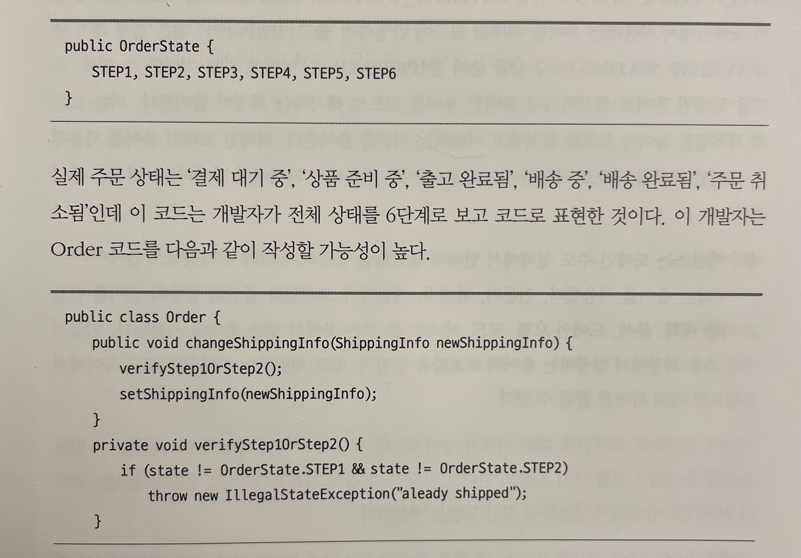

- 해당 코드는 중요한 도메인 규칙을 표현하기 어렵다.
- 개발자는 STEP1과 STEP2에 대해서 각각 결제 대기 중 상태와 상품 준비 중 상태를 의미한다는 것을 알아야 한다.

다음 코드처럼 도메인 용어를 사용해서 `OrderState` 를 구현하며 이런 불필요한 변환 과정을 거치지 않아도 된다.

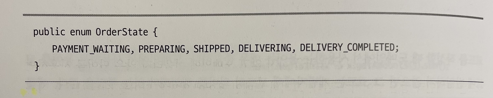

- 코드를 도메인 용어로 해석하거나 도메인 용어를 코드로 해석하는 과정이 줄어든다.
- 이는 코드의 가독성을 높여서 코드를 분석하고 이해하는 시간을 줄여준다.

### 도메인 용어의 장점

최대한 도메인 용어를 사용해서 도메인 규칙을 코드로 작성하게 되므로(의미를 변환하는 과정에서 발생하는) 버그도 줄어든다.

에릭 에반스는 도메인 주도 설계에서 언어의 중요함을 강조하기 위해 `유비쿼터스 언어` 라는 용어를 사용했다.

- 전문가, 관계자, 개발자가 도메인과 관련된 공통의 언어를 만들고 이를 대화, 문서, 도메인 모델, 코드, 테스트 등 모든 곳에서 같은 용어를 사용한다.
- 소통 과정에서 발생하는 용어의 모호함을 줄일 수 있고 개발자는 도메인과 코드 사이에서 불필요한 해석 과정을 줄일 수 있다.

### 도메인 용어 리팩토링

포인트는 시간의 흐름을 통해 도메인에 대한 이해가 높아지는데 새롭게 이해한 내용을 잘 표현할 수 있는 용어를 찾아내고 다시 공통의 언어로 만들어 다 같이 사용하는 리팩토링이 필요하다.

### 정리

도메인에서 사용하는 용어의 의미를 명확하게 전달하기 위해서 알맞은 영단어를 찾는 것은 쉽지 않은 일이지만 시간을 들여 찾는 노력을 해야 한다.

- 도메인 용어에 알맞은 단어를 찾는 시간을 아까워하지 말자.

## 2.1 네 개의 영역

아키텍처를 설계할 때 출현하는 전형적인 네 가지 영역

- 표현, 응요, 도메인, 인프라스트럭처
- 그 중 표현 영역은 사용자의 요청을 받아 응용 영역에서 전달하고 응용 영역의 처리 결과를 다시 사용자에게 보여주는 역할

웹 어플리케이션의 표현 영역의 역할

- HTTP 요청 파라미터로 전송한 데이터를 응용 서비스가 요구하는 형식의 객체 타입으로 변환해서 전달
- 응용 서비스가 리턴한 결과를 JSON 형식으로 변환해서 HTTP 응답으로 웹 브라우저에 전달

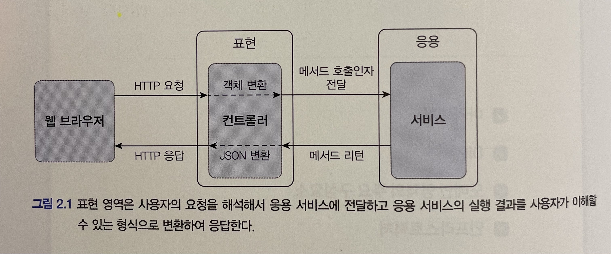

응용 영역

- 시스템이 사용자에게 제공해야 할 기능을 구현
- 기능을 구현하기 위해 도메인 영역의 도메인 모델을 사용
- 로직을 직접 수행하기보다는 도메인 모델에 로직 수행을 위임
- ex) 주문 등록, 주문 취소, 상품 상세 조회 와 같은 기능 구현

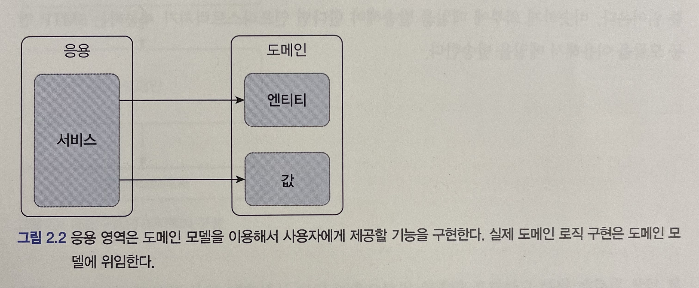

도메인 영역

- 도메인 모델을 구현
- 도메인의 핵심 로직을 구현
- ex) 배송지 변경, 결제 완료, 주문 총액 계산 과 같은 기능 구현

인프라스트럭쳐 영역

- 구현 기술에 대한 것
- RDBMS 연동을 처리하고 메시징 큐에 메시지를 전송 / 수신하는 기능을 구현, 몽고 DB나 레디스와 데이터 연동 처리

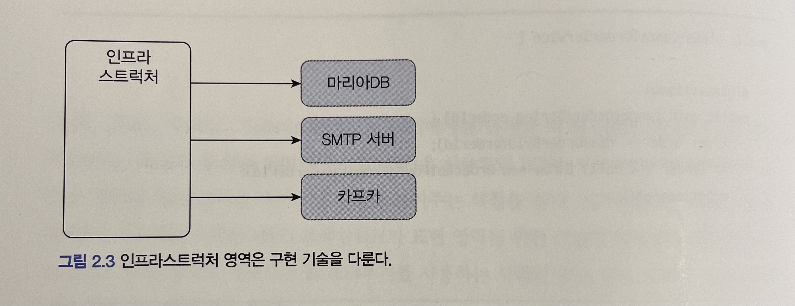

#### 정리

- 아키텍처를 설계할 때 출현하는 공통적인 영역으로는 표현 영역, 응용 영역, 도메인 영역, 인프라스트럭쳐 영역이 있다.
- 표현 영역은 HTTP 요청 파라미터를 응용 서비스의 객체로 전달하고 응용 서비스가 반환한 응답 결과를 HTTP 응답으로 전달한다.
- 응용 영역은 시스템에서 사용자에게 재공해야 할 기능을 구현하며 로직을 직접 수행하기보다는 도메인 모델에 로직 수행을 위임한다.
- 도메인 영역은 도메인 모델을 구현하며, 핵심 로직을 구현한다.
- 인프라스트럭쳐 영역은 RDBMS 및 메시징 큐, 외부 API 연동 등을 구현한다.

## 느낀 점

- 엘레강트 오브젝트 및 이펙티브 자바를 읽으면서 알고 있었던 내용들이  개념으로 정리되는 것 같다.
- 유지보수를 하면서 도메인 모델로 리팩토링 해볼 수 있을까?
  - 제일 중요한건 일정인데 심지어 단위테스트 코드도 없음
  - 현재 진행하고 있는 방식은
    - 유지보수 요건 분석 /설계
    - 단위테스트 코드 작성을 통해 안전망 역할
    - 유지보수 요건 개발
    - 단위테스트 코드 수정
- 1.3, 1.4에서 도메인 모델에서 도메인을 이해하기 위한 방안으로 도메인 모델링에 대한 종류 소개
  - 실제 현업에서 사용하면서 좋은 사례가 있는지 확인