# 도베인 주도 개발 시작하기 : DDD 핵심 개념 정리부터 구현까지

- 정리 범위
  - Chapter 2 아키텍처 개요 :  2.2 ~ 2.4

## 2.2 계층 구조 아키텍처 

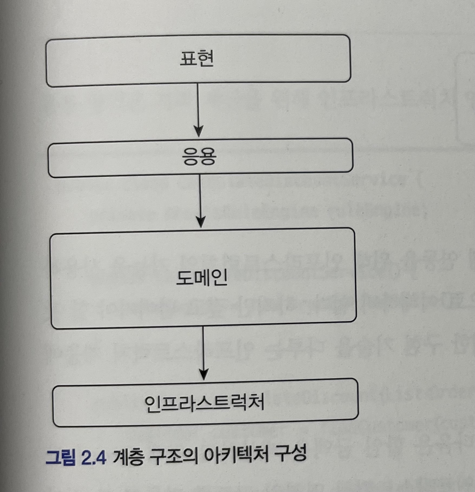

계층 구조는 그 특성상 상위 계층에서 하위 계층으로의 의존만 존재하고 하위 계층은 상위 계층에 의존하지 않는다.

|    계층         |      사용      |     의존 방향     |
|----------------|---------------|----------------|
|    표현 영역     |   도메인 영역    |   응용 계층에 의존 |
|    응용 영역     |   도메인 영역    |  도메인 계층에 의존 |
|     도메인 영역   | 인프라스트럭처 영역|                 |
| 인프라스트럭처 영역 |        -      |                 |

계층 구조를 엄격하게 적용한다면 상위 계층은 바로 아래의 계층에만 의존을 가져야 하지만 구현의 편리함을 위해 계층 구조를 유연하게 적용하기도 한다.

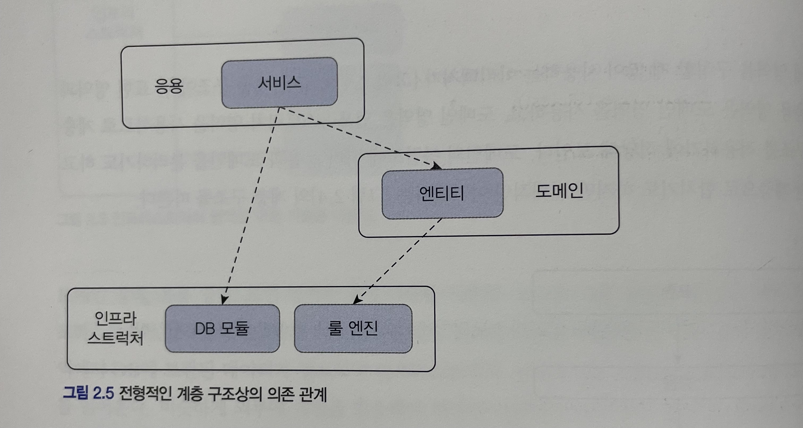

- 응용 계층은 바로 아래 계층인 도메인 계층에 의존하지만 외부 시스템과의 연동을 위해 더 아래 계층인 인프라스트럭쳐 계층에 의존
- 표현, 응용, 도매인 계층이 상세한 구현 기술을 다루는 인프라스트럭쳐 계층에 종속된다는 점이다.

### 예시를 알아보자.

도메인의 가격 계산 규칙을 예로 보자.
할인 금액을 계산하기 위해 `Drools` 라는 룰 엔진을 사용해서 계산 로직을 수행하는 인프라스트럭쳐 영역의 코드를 만들어본다.

```java
public class DroolsRuleEngine {
    private KieContainer kieContainer;

    public DroolsRuleEngine() {
        KieService ks = KieService.Factory.get();
        kContainer = ks.getKieClasspathContainer();
    }

    public void evalute(String sessionName, List<?> facts) {
        KieSession kSession = kContainer.newKieSession(sessionName);
        try {
            facts.forEach(x -> kSession.insert(x));
            kSession.fireAllRules();
        } finally {
            kSession.dispose();
        }
    }
}
```

응용 영역은 가격 계산을 위해 인프라스트럭쳐 영역의 DroolsRuleEngine을 사용한다.

```java
public class CalculateDiscountService {
    private DroolsRuleEngine ruleEngine;

    public CalculateDiscountService {
        ruleEngine = new DroolsRuleEngine();
    }

    public Money calculateDiscount(List<OrderLine> orderLunes, String customerId) {
        Customer customer = findCustomer(customerId);

        MutableMoney money = new MutableMoney(0);
        List<?> facts = Arrays.asList(customer, money);
        facts.addAll(orderLines);
        ruleEngine.evalute("discountCalculation", facts);
        return money.toImmutableMoney();
    }
}
```

이 코드는 두 가지 문제를 안고 있다.

#### `CalculateDiscountService` 만 테스트하기 어렵다.

- 해당 코드를 테스트하려면 RuleEngine이 완벽하게 동작해야 한다.
- RuleEngine 클래스와 관련 설정 파일을 모두 만든 이후에 비로소 CalculateDiscountService가 올바르게 동작하는지 확인이 가능하다.

#### 구현 방식을 변경하기 어렵다.

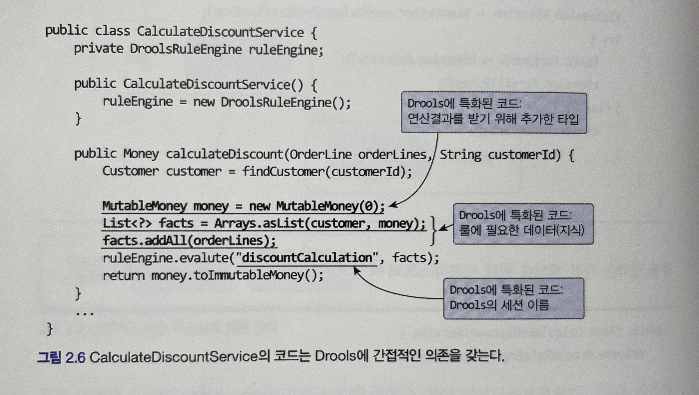

- `discountCalculation` 문자열은 Drools의 세션 이름을 의미하는데, Drools의 세션 이름을 변경하면 `CalculateDiscountService` 의 코드도 함께 변경해야 한다.
- `MutableMoney` 는 룰 적용 결과값을 보관하기 위해 추가한 타입인데 다른 방식을 사용했다면 필요 없는 타입이다.

`CalculateDiscountService` 가 `Drools` 라는 인프라스트럭처 영역의 기술에 완전하게 의존하고 있어서 다른 구현 기술을 사용하려면 코드의 많은 부분을 고쳐야 한다.

인프라스트럭쳐에 의존하면 `테스트 어려움` 과 `기능 확장의 어려움` 이라는 두 가지 문제가 발생한다.

어떻게 해야 이 두 문제를 해소할 수 있을까? 해답은 `DIP`에 있다.

## 2.3 DIP

DIP(의존관계 역전 원칙, Dependency Inversion Principle)

- 프로그래머는 "추상화에 의존해야지, 구체화에 의존하면 안된다." 의존성 주입이 이 원칙을 따르는 방법 중 하나
- 쉽게 이야기해서 구현 클래스에 의존하지 말고, 인터페이스에 의존하라는 뜻
- 역할(Role)에 의존하게 해야 한다는 것 
- 객체 세상도 클라이언트가 인터페이스에 의존해야 유연하게 구현체를 변경할 수 있다. 구현체에 의존하게 되면 변경이 아주 어려워집니다.

### 예시를 알아보자

가격 할인 계산을 하려면 다음 그림과 같이 고객 정보를 구해야 하고, 구한 고객 정보와 주문 정보를 이용해서 룰을 실행해야 한다.

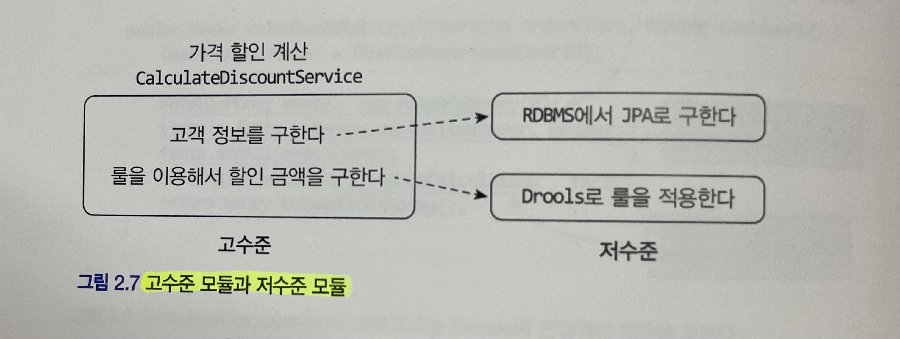

- 고수준 모듈은 의미 있는 단일 기능을 제공하는 모듈로 
  - `CalculateDiscountService` 는 고수준 모듈로 `가격 할인 계산` 이라는 기능을 구현
  - 고수준 모듈의 기능을 구현하려면 여러 하위 기능이 필요
- 저수준 모듈은 하위 기능을 실제로 구현한 모듈
  - `JPA` 를 이용해서 고객 정보를 읽어오는 모듈과 `Drools` 로 룰을 실행하는 모듈이 저수준 모듈 

고수준 모듈이 저수준 모듈을 사용하게 되면 두 가지 문제, 즉 구현 변경과 테스트가 어렵다는 문제가 발생한다.

DIP는 이 문제를 해결하기 위해 저수준 모듈이 고수준 모듈에 의존하도록 바꾼다.

- 비밀은 추상화한 인터페이스에 있다.

`CalculateDiscountService` 입장에서 봤을 때 룰 적용을 `Drools` 로 구현했는지 자바로 직접 구현했는지는 중요하지 않다. `고객 정보와 구매 정보에 룰을 적용해서 할인 금액을 구한다` 라는 것만 중요하다.

```java
public interface RuleDiscounter {
    Money applyRules(Customer customer, List<OrderLine> orderLines);
}
```

이 인터페이스를 이용해서 `CalculateDiscountService` 가 `RuleDiscounter` 를 이용하도록 바꾸면,

```java
public class CalculateDiscountService {

    private RuleDiscounter ruleDiscounter;

    public CalculateDiscountService(RuleDiscounter ruleDiscounter) {
        this.ruleDiscounter = ruleDiscounter;
    }

    public Money calculateDiscount(List<OrderLine> orderLines, String customerId) {
        Customer customer = findCustomer(customerId);
        return ruleDiscounter.applyRules(customer, orderLines);
    }

    // 비즈니스 로직
}
```

- `CalculateDiscountService` 에는 `Drools` 에 의존하는 코드가 없다.

```java
public class DroolsRuleDiscounter implements RuleDiscounter {
    private KieContainer kieContainer;

    public DroolsRuleEngine() {
        KieService ks = KieService.Factory.get();
        kContainer = ks.getKieClasspathContainer();
    }

    @Override
    public Money applyRules(Customer customer, List<OrderLine> orderLines) {
        KieSession kSession = kContainer.newKieSession(sessionName);
        try {
            // 코드 생략
            kSession.fireAllRules();
        } finally {
            kSession.dispose();
        }
        return money.toImmutableMoney();
    }
}
```

`DIP` 를 적용한 구조는 다음과 같다.

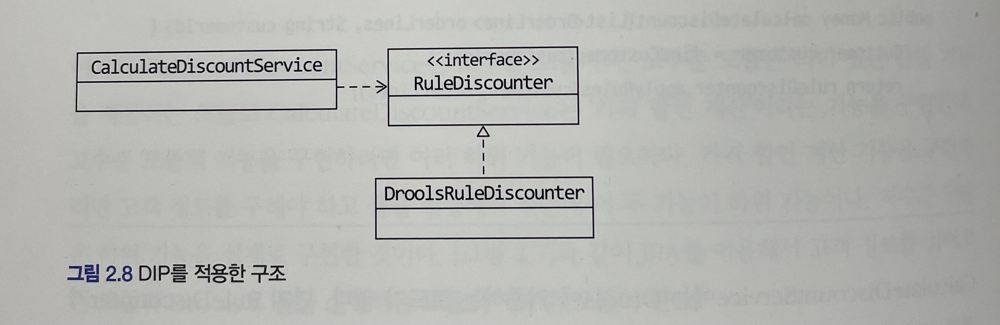

저수준 모듈이 고수준 모듈에 의존하는 형태는 다음과 같다.

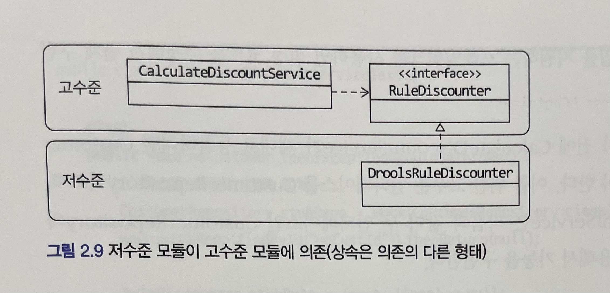

- 고수준 모듈이 저수준 모듈을 사용하려면 고수준 모듈이 저수준 모듈에 의존해야 하는데, 반대로 저수준 모듈이 고수준 모듈에 의존한다고 해서 이를 `DIP`, `의존 역전 원칙` 이라고 한다.

Repository 역시 인터페이스를 통해서 해당 문제를 해결할 수 있다. (여기서는 생략)

### 2.3.1 DIP 주의사항

DIP를 잘못 생각하면 단순히 인터페이스와 구현 클래스를 분리하는 정도로 받아들일 수 있다. 

DIP의 핵심은, 

- 고수준 모듈이 저수준 모듈에 의존하지 않도록 하기 위함

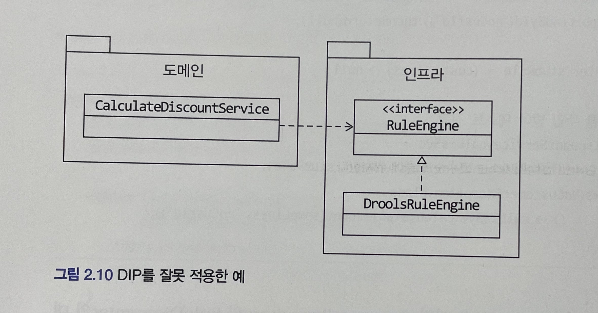

- 이 구조는 도메인 영역은 구현 기술을 다루는 인프라스트럭처 영역에 의존하고 있다.
- `RuleEngine` 인터페이스는 고수준 모듈인 도메인 관점이 아니라 룰 엔진이라는 저수준 모듈 관점에서 도출한 것이다.

DIP를 적용할 때 하위 기능을 추상화한 인터페이스는 고수준 모듈 관점에서 도출한다.

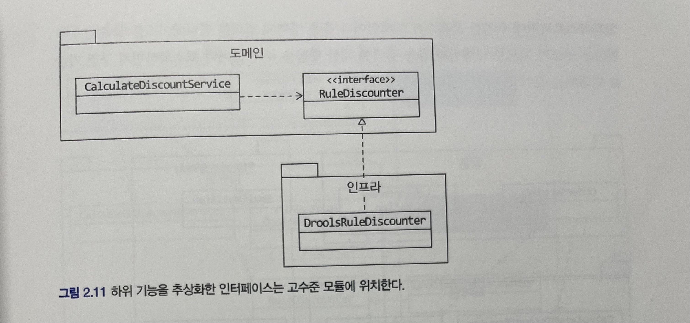

### 2.3.2 DIP와 아키텍처

인프라스트럭처 영역은 구현 기술을 다루는 저수준 모듈이고 응용 영역과 도메인 영역은 고수준 모듈이다.

인프라스트럭쳐 계층이 가장 하단에 위치하는 계층형 구조와 달리 아키텍처에 DIP를 적용하면 그림과 같이 인프라스트럭처 영역이 응용 영역과 도메인 영역에 의존(상속)하는 구조가 된다.

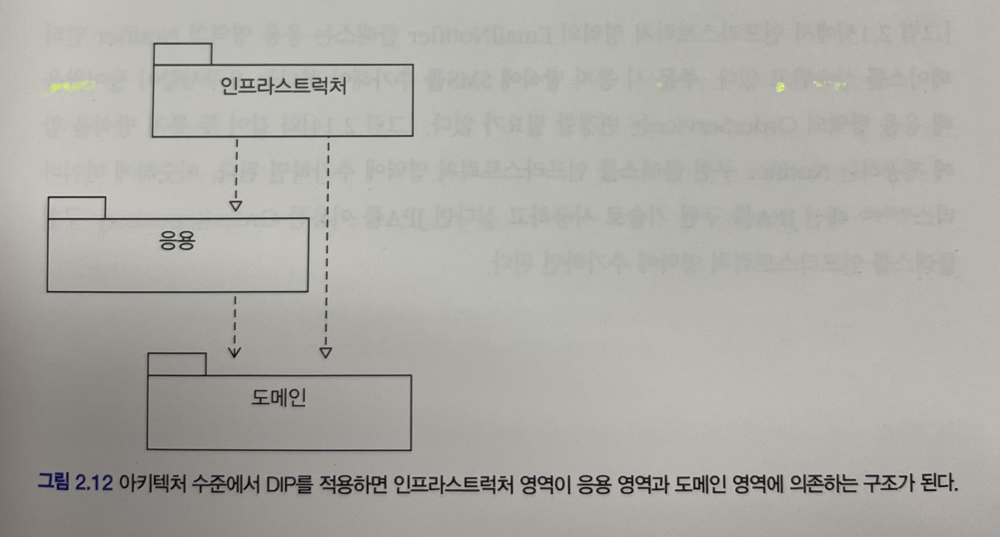

인프라스트럭처에 위치한 클래스가 도메인이나 응용 영역에 정의한 인터페이스를 상속받아 구현하는 구조가 되므로 도메인과 응용 영역에 대한 영향을 주지 않거나 최소화하면서 구현 기술을 변경하는 것이 가능하다.

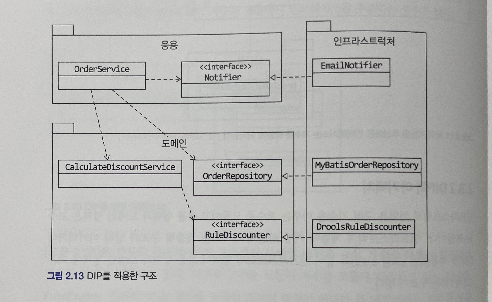

요구사항 변경이 일어나면 다음과 같이 인프라스트럭처 영역에 추가하면 된다.

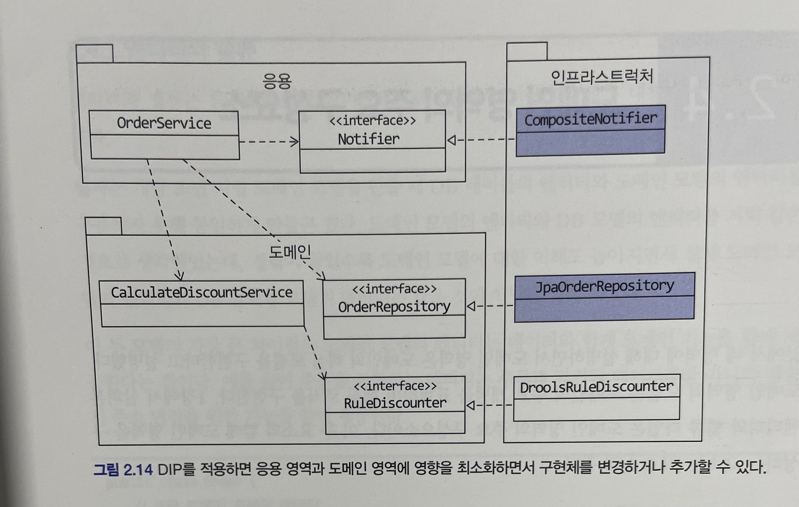

> DIP를 항상 적용할 필요는 없다. 
> 사용하는 구현 기술에 따라 완벽한 DIP를 적용하기보다는 구현 기술에 의존적인 코드를 도메인에 일부 포함하는 게 효과적일 때도 있다. 또는 추상화 대상이 잘 떠오르지 않을 때도 있다. 이럴 때는 무조건 DIP를 적용하려고 시도하지 말고 DIP의 이점을 얻는 수준에서 적용 범위를 검토해보자.

## 2.4 도메인 영역의 주요 구성요소

도메인 영역의 모델은 도메인의 주요 개념을 표현하며 핵심 로직을 구현한다.

- 엔티티와 밸류 타입은 도메인 영역의 주요 구성 요소

도메인 영역의 주요 구성 요소
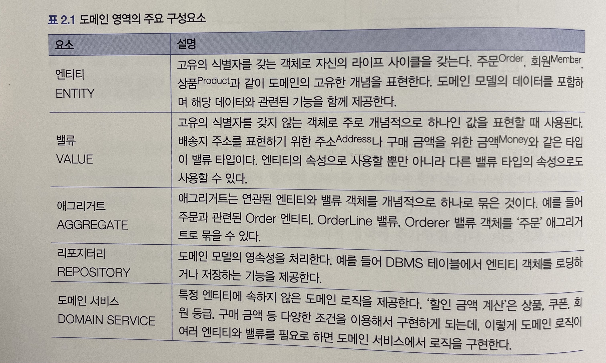

### 2.4.1 엔티티와 밸류

> 필자는 개발 초년 시절 도메인 모델을 만들 때 DB 테이블의 엔티티와 도메인 모델의 엔티티를 구분하지 못해 동일하게 만들곤 했다. 도메인 모델의 엔티티와 DB 모델의 엔티티를 거의 같은 것으로 생각했는데, 경험이 쌓일수록 도메인 모델에 대한 이해도 높아지면서 실제 도메인 모델의 엔티티와 DB 관계형 모델의 엔티티는 같은 것이 아님을 알게 되었다.

실제 도메인 모델의 엔티티와 DB 관계형 모델의 엔티티의 가장 큰 차이점은 도메인 모델의 엔티티는 데이터와 함께 도메인 기능을 제공한다는 점이다.

도메인 모델의 엔티티 - 주문 도메인 예시

```java
public class Order {
    // 주문 도메인 모델의 데이터
    private OrderNo number;
    private Orderer orderer;
    private ShippingInfo shippingInfo;
    ...

    // 도메인 모델 엔티티는 도메인 기능도 함께 제공
    public void changeShippingInfo(ShippingInfo shippingInfo) {
        checkShippingInfoChageable();
        setShippingInfo(newShippingInfo);
    }

    private void setShippingInfo(ShippingInfo shippingInfo) {
        if (newShippingInfo == null) throw new IllegalArgumentException();
        // 밸류 타입의 데이터를 변경할 때는 새로운 객체로 교체한다.
        this.shippingInfo = newShippingInfo;
    }
}
```

- 도메인 모델의 엔티티는 단순히 데이터를 담고 있는 데이터 구조라기보다는 데이터와 함께 기능을 제공하는 객체이다.
- 도메인 관점에서 기능을 구현하고 기능 구현을 캡슐화해서 데이터가 임의로 변경되는 것을 막음
- 도메인 모델의 엔티티는 두 개 이상의 데이터가 개념적으로 하나인 경우 밸류 타입을 이용해서 표현

### 2.4.2 애그리거트

도메인이 커질수록 개발할 도메인 모델도 커지면서 많은 엔티이와 밸류가 출현한다. 엔티티와 밸류 개수가 많아질수록 모델은 점점 더 복잡해진다.

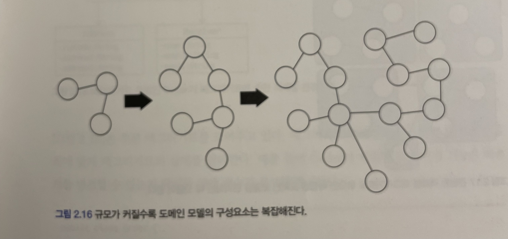

지도를 볼 때 매우 상세하게 나온 대축적 지도를 보면 큰 수준에서 어디에 위치하고 있는지 이해하기 어려우므로 큰 수준에서 보여주는 소축적 지도를 함께 봐야 현재 위치를 보다 정확하게 이해할 수 있다.

- 도메인 모델도 개별 객체뿐만 아니라 상위 수준에서 모델을 볼 수 있어야 전체 모델의 관계와 개별 모델을 이해하는 데 도움이 된다. 도메인 모델에서 전체 구조를 이해하는 데 도움이 되는 것이 바로 `애그리거트` 이다.

애그리거트란?

- 관련 객체를 하나로 묶은 군집
- 대표적인 예가 주문
  - 주문이라는 도메인 개념은 `주문`, `배송지 정보`, `주문자`, `주문 목록`, `총 결제 금액` 의 하위 모델로 구성된다.
  - 이 하위 개념을 표현한 모델을 하나로 묶어서 `주문`이라는 상위 개념으로 표현할 수 있다.

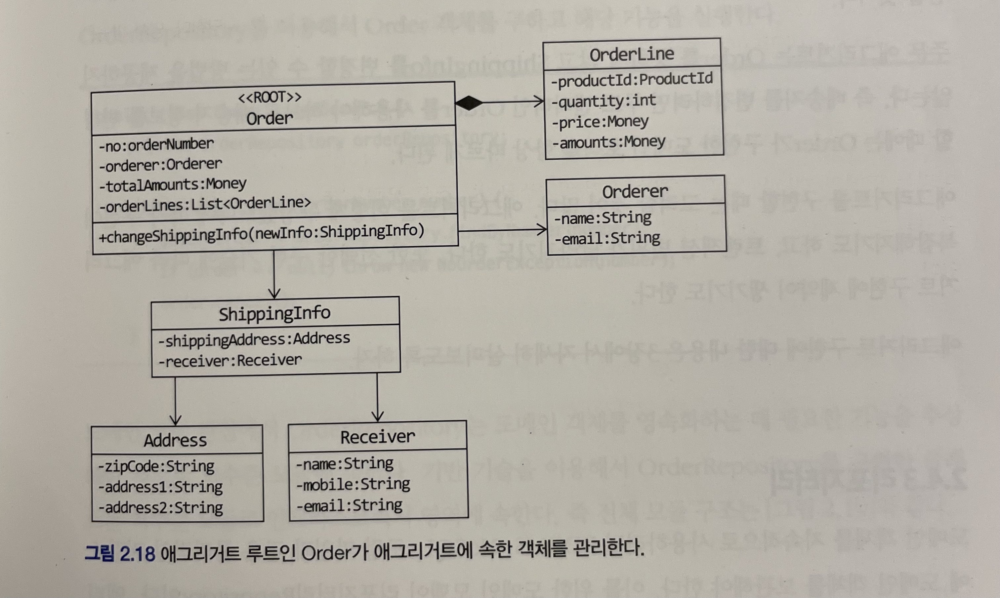

개별 객체 간의 관계가 아닌 애그리거트 간의 관계로 도메인 모델을 이해하고 구현하게 되며, 이를 통해 큰 틀에서 도메인 모델을 관리할 수 있다.

> 애그리거트를 어떻게 구성했느냐에 따라 구현이 복잡해지기도 하고, 트랜잭션 범위가 달라지기도 한다. 또한 선택한 구현 기술에 따라 애그리거트 구현에 제약이 생기기도 한다.

### 2.4.3 리포지터리

리포지터리란?

- 도메인 객체를 지속적으로 사용하려면 RDBMS, NoSQL, 로컬 파일과 같은 물리적인 저장소에 도메인 객체를 보관하기 위한 도메인 모델 
- 엔티티나 밸류가 요구사항에서 도출되는 도메인 모델이라면 리포지터리는 구현을 위한 도메인 모델이다.
- 리포지터리는 애그리거트 단위로 도메인 객체를 저장하고 조회하는 기능을 정의한다.

주문의 대한 예시

```java
public inteface OrderRepository {
    Order findByNumber(OrderNumber number);
    void save(Order order);
    void delete(Order order);
}
```

- Order는 애그리거트에 속한 모든 객체를 포함하고 있으므로 결과적으로 애그리거트 단위로 저장하고 조회한다.

도메인 모델을 사용해야 하는 코드를 리포지터리를 통해서 도메인 객체를 구한 뒤에 도메인 객체의 기능을 실행한다.

```java
public class CancelOrderService {
    private OrderRepository orderRepository;

    public void cancel(OrderNumber number) {
        Order order = orderRepository.findByNumber(number);
        if (order == null) {
            throw new NoOrderException(number);
        }
        order.cancel();
    }
}
```

- 도메인 모델 관점에서 OrderRepository는 도메인 객체를 영속화하는 데 필요한 기능을 추상화한 것으로 고수준 모듈에 속한다.

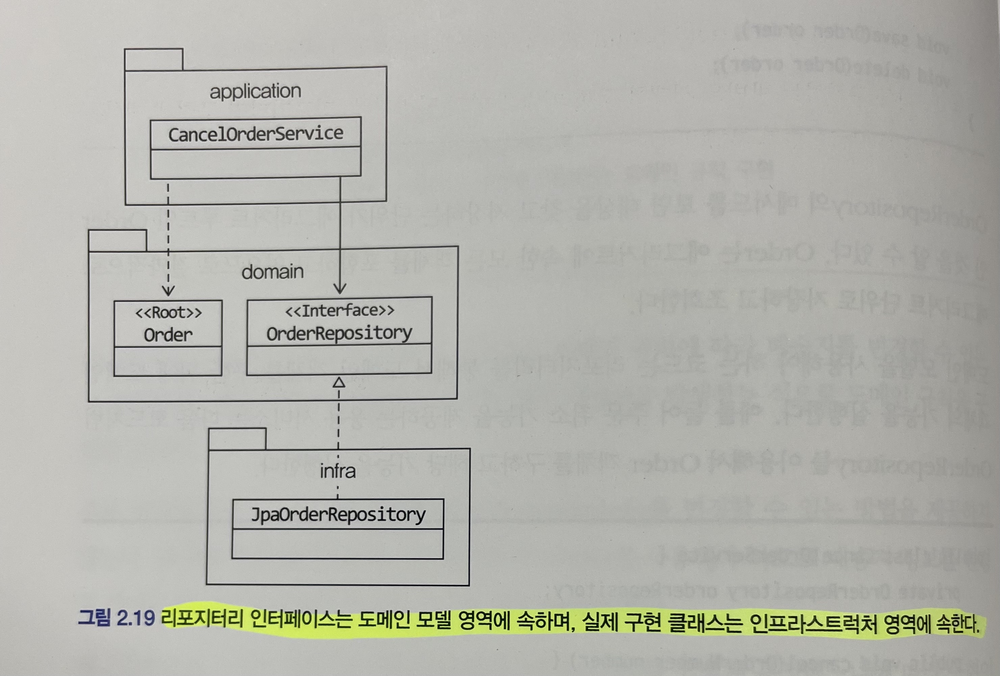

응용 서비스는 의존 주입과 같은 방식을 사용해서 실제 리포지터리 구현 객체에 접근한다. 응용 서비스와 리포지터리는 밀접한 연관이 있다.

- 응용 서비스는 필요한 도메인 객체를 구하거나 저장할 때 리포지터리를 사용한다.
- 응용 서비스는 트랜잭션을 관리하는데, 트랜잭션 처리는 리포지터리 구현 기술의 영향을 받는다.

리포지터리를 사용하는 주체가 응용 서비스이기 때문에 리포지터리는 응용 서비스가 필요로 하는 메서드를 제공한다.

- 애그리거트를 저장하는 메서드
- 애그리거트 루트 식별자로 애그리거트를 조회하는 메서드

```java
public interface SomeRepository {
    void save(Some some);
    Some findById(SomeId id);
}
```

## 정리

- 인프라스트럭처에 의존하면 `테스트 어려움` 과 `기능 확장의 어려움` 이라는 두 가지 문제가 발생할 수 있다.
- 이를 해결하기 위해서 `DIP` 를 통해서 해결할 수 있다.
- 고수준 모듈을 구현하려면 저수준 모듈을 사용해야 하는데. 반대로 저수준 모듈이 고수준 모듈에 의존하도록 하려면 추상화한 인터페이스가 필요하다.
- DIP를 적용할 때 하위 기능을 추상화한 인터페이스는 고수준 모듈 관점에서 도출한다.
- 도메인 모델의 엔티티와 DB 모델의 엔티티의 가장 큰 차이점은 데이터와 함께 도메인 기능을 함께 제공하는 것이다.
- 도메인 모델도 개별 객체뿐만 아니라 상위 수준에서 모델을 볼 수 있어야 전체 모델의 관계와 개별 모델을 이해하는데 도움이 된다. 도메인 모델에서 전체 구조를 이해하는 데 도움이 되는 것이 바로 `애그리거트` 이다.
- `리포지터리` 는 `애그리거트` 단위로 도메인 객체를 저장하고 조회하는 기능을 정의한다.

## 궁금한 점

- 실제 도메인 모델의 엔티티와 DB 관계형 모델를 나누는 이유는 무엇일까? JPA를 통해서 하나의 도메인에서 관리할 수 없을까?
- DIP를 통해서도 해결할 수 있지만 OCP를 통해서도 해결할 수 있지 않을까?
  - [[객체지향] OCP 적용 정리](https://lovethefeel.tistory.com/66)