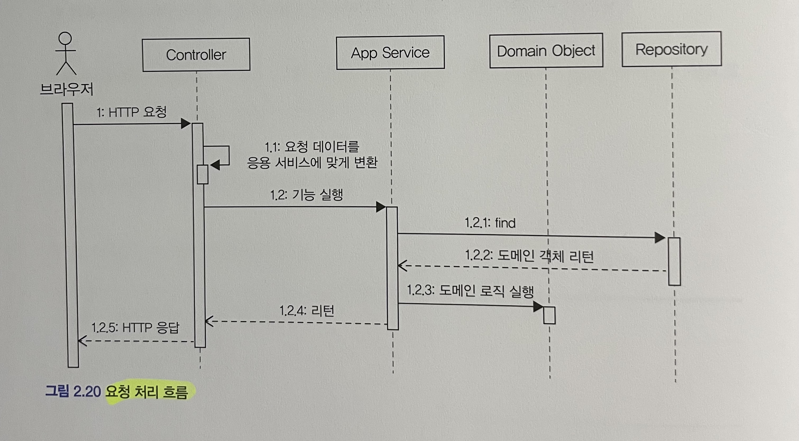
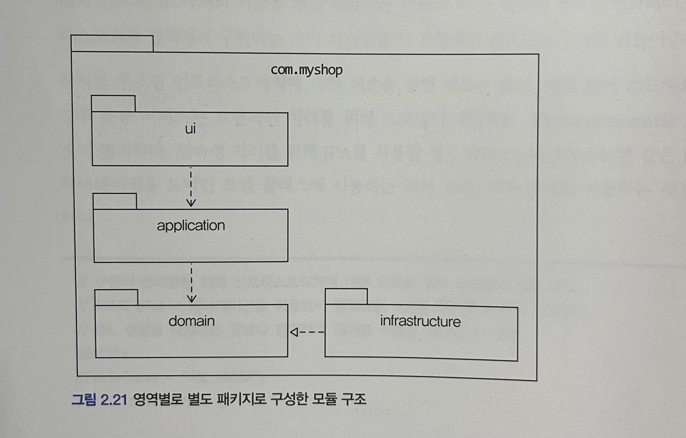
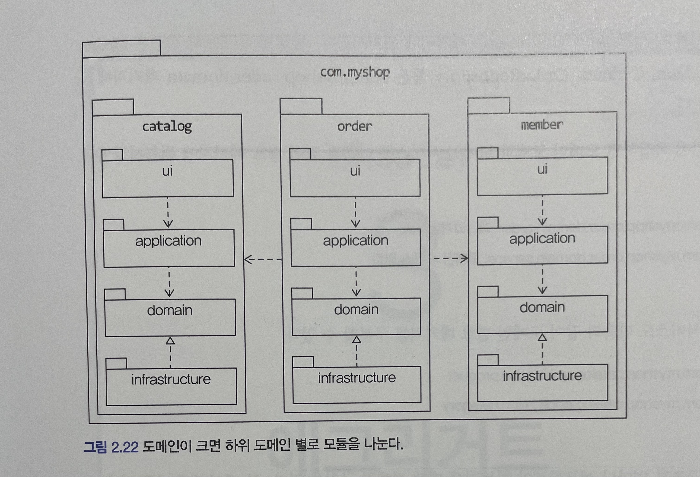
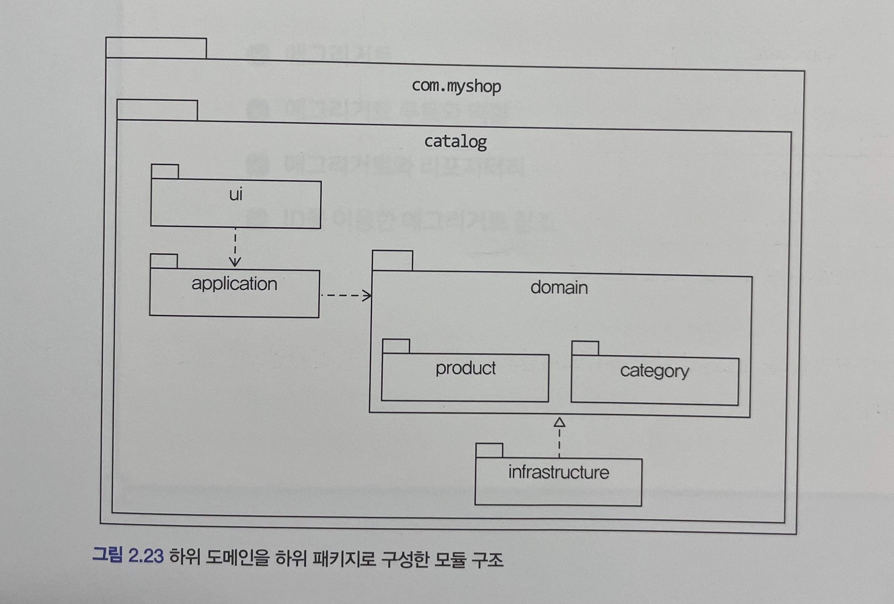
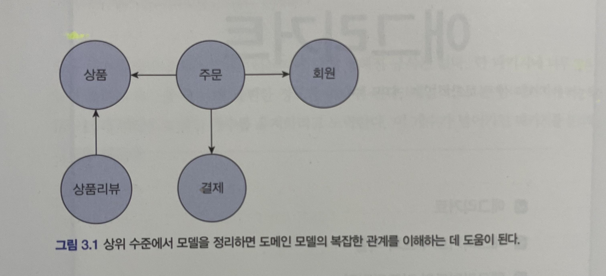
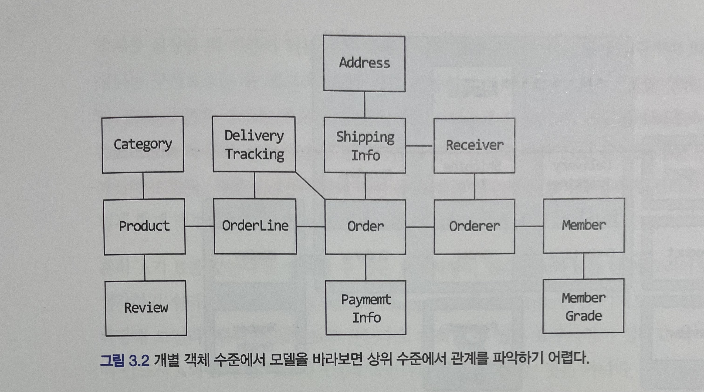
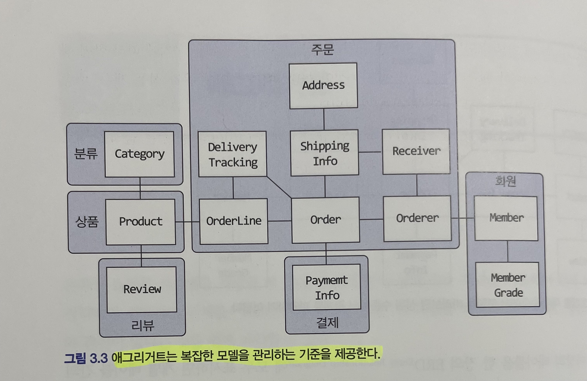
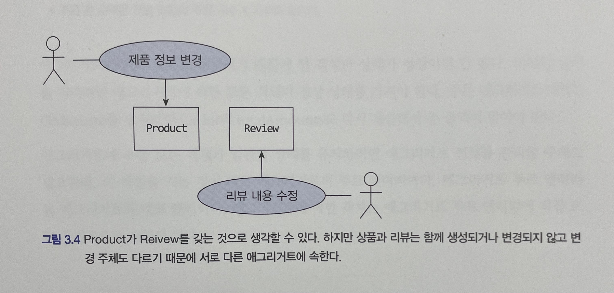

# 도베인 주도 개발 시작하기 : DDD 핵심 개념 정리부터 구현까지

- 정리 범위
  - Chapter 2 아키텍처 개요 :  2.5 ~ 2.7
  - Chapter 3 애그리거트 : 3.1

## 2.5 요청 처리 흐름

표현 영역

- 요청을 처음 받는 영역
- 사용자가 전송한 데이터 형식이 올바른지 검사하고 문제가 없다면 데이터를 이용해서 응용 서비스에 기능 실행을 위임한다. 
- 사용자가 전송한 데이터를 응용 서비스가 요구하는 형식으로 변환해서 전달한다.

- 표현 영역에 해당하는 컨트롤러는 HTTP 요청 파라미터를 응용 서비스가 필요로 하는 데이터로 변환해서 응용 서비스를 실행할 때 인자로 전달

응용 서비스

- 도메인 모델을 이용해서 기능을 구현한다.
- 기능 구현에 필요한 도메인 객체를 리포지터리에서 가져와 실행하거나 신규 도메인 객체를 생성해서 리포지터리에 저장한다.
- 두 개 이상의 도메인 객체를 사용해서 구현하기도 한다.
- 예매하기나 예매 취소와 같은 기능을 제공하는 응용 서비스는 도메인의 상태를 변경하므로 변경 상태가 물리 저장소에 올바르게 반영되도록 트랜잭션을 관리해야 한다.
  - ex) 스프링에서 제공하는 @Transactional

## 2.6 인프라스트럭처 개요

인프라스트럭처

- 표현 영역, 응용 영역, 도메인 영역을 지원한다.
- 도메인 영역과 응용 영역에서 인프라스트럭처의 기능을 직접 사용하는 것보다 이 두 영역에 정의한 인터페이스를 인프라스트럭처 영역에서 구현하는 것이 시스템을 더 유연하고 테스트하기 쉽게 만들어준다.
- 영속성 처리를 위해 JPA를 사용할 경우 @Entity나 @Table과 같은 JPA 전용 애너테이션을 도메인 모델 클래스에 사용하는 것이 XML 매핑 설정을 이용하는 것보다 편리하다.
- 구현의 편리함은 DIP가 주는 다른 장점 (변경의 유연함, 테스트가 쉬움)만큼 중요하기 때문에 DIP의 장점을 해치지 않는 범위에서 응용 영역과 도메인 영역에서 구현 기술에 대한 의존을 가져가는 것이 나쁘지 않다.
  - ex) 스프링의 @Transactional
  - @Transactional을 사용하면 한 줄로 트랜잭션을 처리할 수 있으나, 코드에서 스프링에 대한 의존을 없애려면 복잡한 스프링 설정을 사용해야 한다.

## 2.7 모듈 구성

아키텍처의 각 영역은 별도 패키지에 위치한다.

도메인 모듈은 도메인에 속한 애그리거트를 기준으로 다시 패키지를 구성한다.

- 애그리거트, 모델, 리포지터리는 같은 패키지에 위치시킨다.
  - ex) 주문과 관련된 Order, OrderLine, Orderer, OrderRepository 등은 com.myshop.order.domain 패키지에 위치
- 한 패키지에 너무 많은 타입이 몰려서 코드를 찾을 때 불편한 정도만 아니면 된다.

## 3.1 애그리거트

- 상위 수준에서 모델을 정리하면 도메인 모델의 복잡한 관계를 이해하는 데 도움이 된다.

- 개별 객체 수준에서 모델을 바라보면 상위 수준에서 관계를 파악하기 어렵다.
- 도메인 객체 모델이 복잡해지면 개별 구성요소 위주로 모델을 이해하게 되고 전반적인 구조나 큰 수준에서 도메인 간의 관계를 파악하기 어려워진다.
- 주요 도메인 요소 간의 관계를 파악하기 어렵다는 것은 코드를 변경하고 확장하는 것이 어려워진다는 것을 의미한다.
- 복잡한 도메인을 이해하고 관리하기 쉬운 단위로 만들려면 상위 수준에서 모델을 조망할 수 있는 방법이 필요한데, 그 방법이 바로 애그리거트다.

애그리거트의 개념은 다음과 같습니다.

- 관련 객체를 하나의 군으로 묶어준다.

수많은 객체를 애그리거트로 묶어서 바라보면 상위 수준에서 도메인 모델 간의 관계를 파악할 수 있다.

애그리거트는 모델을 이해하는 데 도움을 줄 뿐만 아니라 일관성을 관리하는 기준도 된다.

- 애그리거트 단위로 일관성을 관리 -> 복잡한 도메인을 단순화시킴 -> 도메인 기능을 확장하고 변경하는 데 필요한 노력이 줄어듬

애그리거트는 관련된 모델을 하나로 모았기 때문에 한 애그리거트에 속한 객체는 유사하거나 동일한 라이프 사이클을 갖는다.

- 에를 들어서, 주문 애그리거트를 만들려면 Order, OrderLine, Orderer 와 같은 관련 객체를 함께 생성해야 한다.
- Order는 생성했는데, ShippingInfo는 만들지 않거나 ShippingInfo를 생성하면서 Orderer를 생성하지 않는 경우는 없다.

애그리거트는 독립된 객체 군이며 각 애그리거트는 자기 자신을 관리할 뿐 다른 애그리거트를 관리하지 않는다.

- 예를 들어서, 주문 애그리거트는 배송지를 변경하거나 주문 상품 개수를 변경하는 등 자기 자신을 관리하지만, 주문 애그리거트에서 회원의 비밀번호를 변경하거나 상품의 가격을 변경하지는 않는다.

경계를 설정할 때 기본이 되는 것은 도메인 규칙과 요구사항이다.

- 예를 들어서, 주문할 상품 개수, 배송지 정보, 주문자 정보는 주문 시점에 함께 생성되므로 이들은 한 애그리거트에 속한다.
- OrderLine의 주문 상품 개수를 변경하면 도메인 규칙에 따라 Order의 총 주문 금액을 새로 계산해야 한다. 
- 사용자 요구사항에 따라 주문 상품 개수와 배송지를 함께 변경하기도 한다.

흔히 A가 B를 갖는다로 설계할 수 있는 요구사항이 있다면 반드시 A와 B가 한 애그리거트에 속한다는 것을 의미하는 것은 아니다.

- 예를 들어서, 상품과 리뷰 도메인이 있다고 가정하자.
- 상품 상세 페이지에 들어가면 상품 상세 정보와 함께 리뷰 내용을 보여줘야 한다는 요구사항이 있을 때 Product 엔티티와 Review 엔티티가 한 애그리거트에 속한다고 생각할 수 있다. 
- Product와 Review는 함께 생성되지 않고, 함께 변경되지도 않는다. 
- Product를 변경하는 주체가 상품 담당자라면 Review를 생성하고 변경하는 주체는 고객이다.

도메인의 경험이 생기고 도메인 규칙을 제대로 이해할수록 애그리거트의 실제 크기는 줄어든다. 그동안 경험을 비추어 보면 다수의 애그리거트가 한 개의 엔티티 객체만 갖는 경우가 많았으며 두 개 이상의 엔티티로 구성되는 애그리거트는 드물었다.

## 정리

- 표현 영역은 사용자가 전송한 데이터의 대한 유효성 검사를 진행하고 응용 서비스가 요구하는 형식으로 변환해서 전달한다.
- 응용 서비스는 도메인 모델을 이용해서 기능을 구현하며, 기능 구현에 필요한 도메인 객체를 리포지터리에서 가져와 실행하거나 신규 도메인 객체를 생성해서 리포지터리에 저장한다.
- 인프라스트럭처는 표현 영역, 응용 영역, 도메인 영역을 지원한다.
- 애그리거트 관련 객체를 하나의 군으로 묶어주며, 수많은 객체를 애그리거트로 묶어서 바라보면 상위 수준에서 도메인 모델 간의 관계를 파악할 수 있다.
  - 모델을 이해하는 데 도움을 줄 뿐만 아니라 일관성을 관리하는 기준도 된다.
  - 애그리거트 단위로 관일관성을 관리하면 복잡한 도메인을 단순한 구조로 만들어주며 복잡도가 낮아지는 만큼 도메인 기능을 확안장하고 변경하는 데 필요한 노력이 줄어든다.