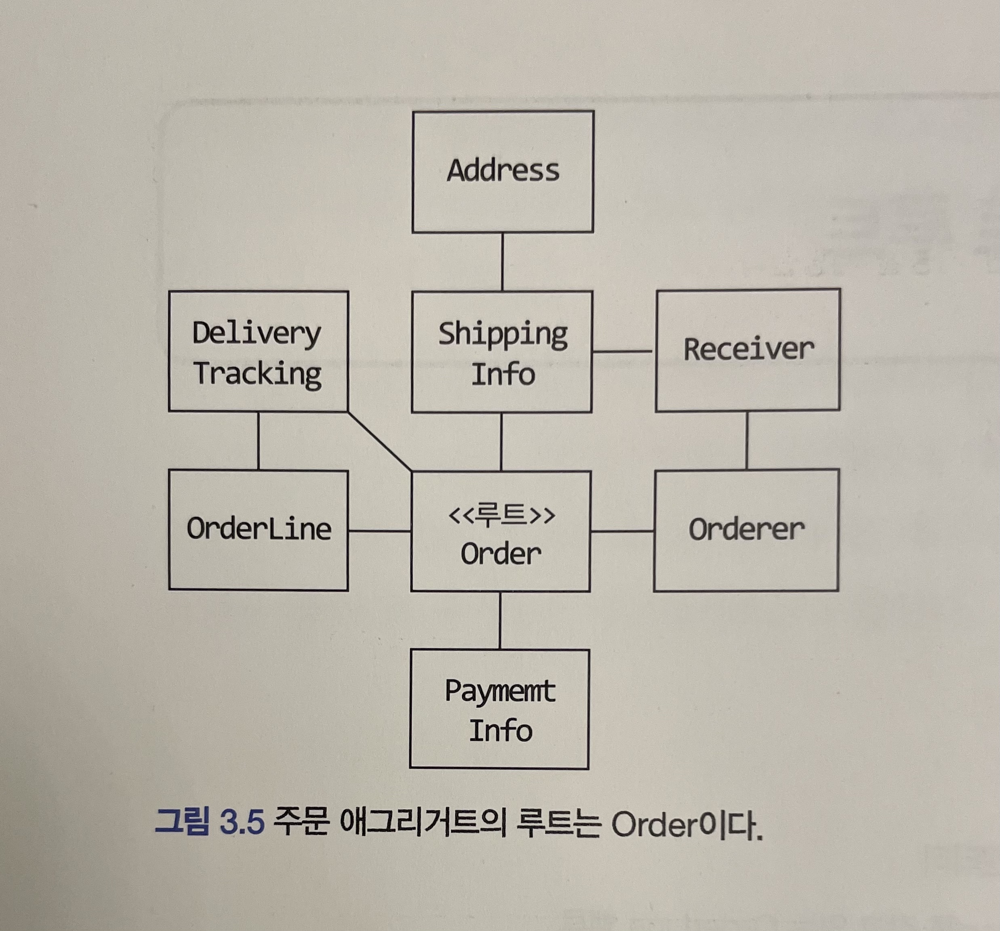
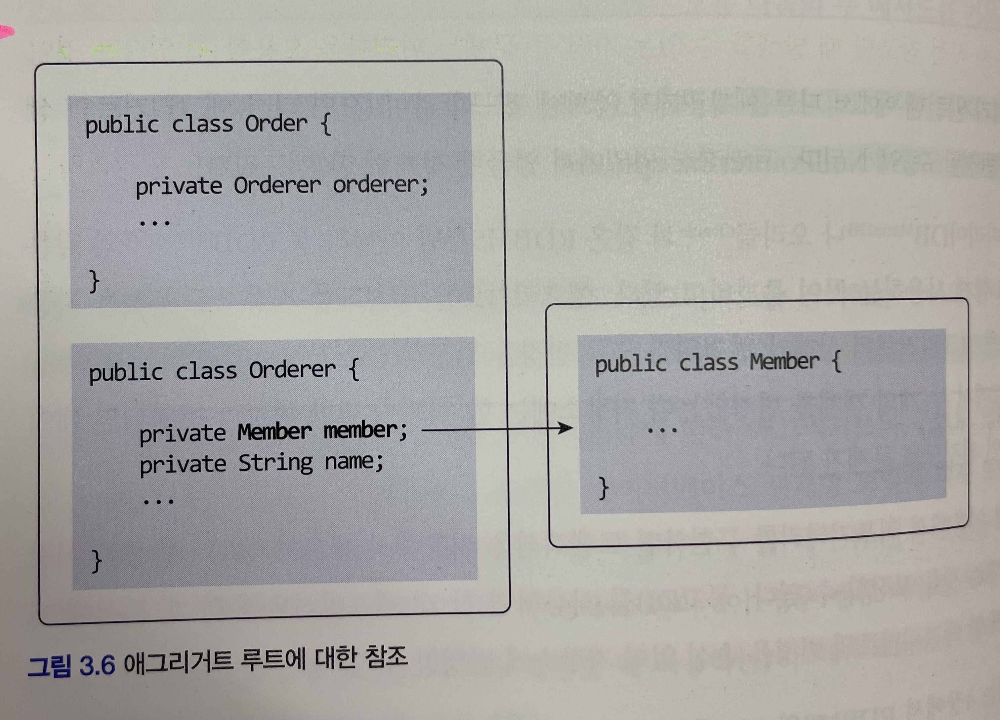
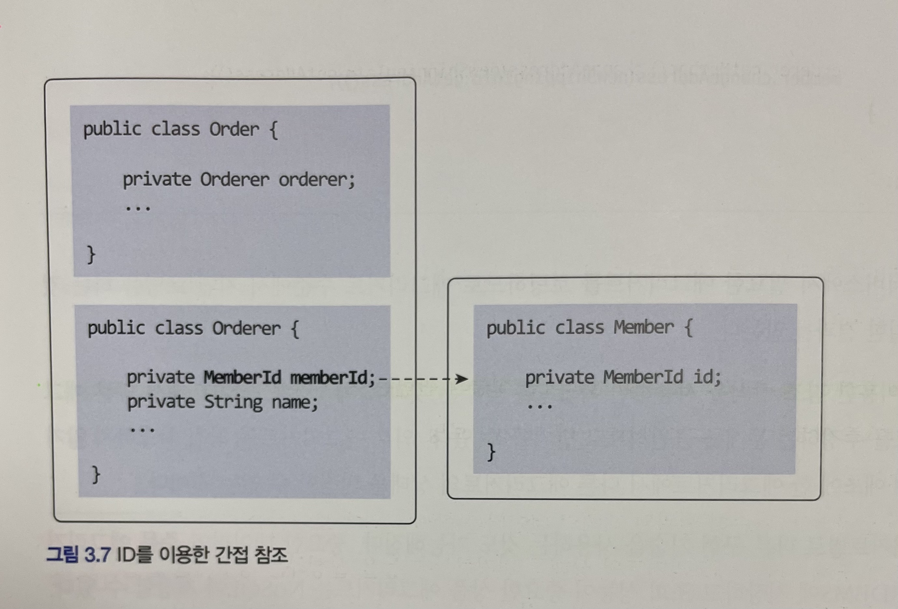
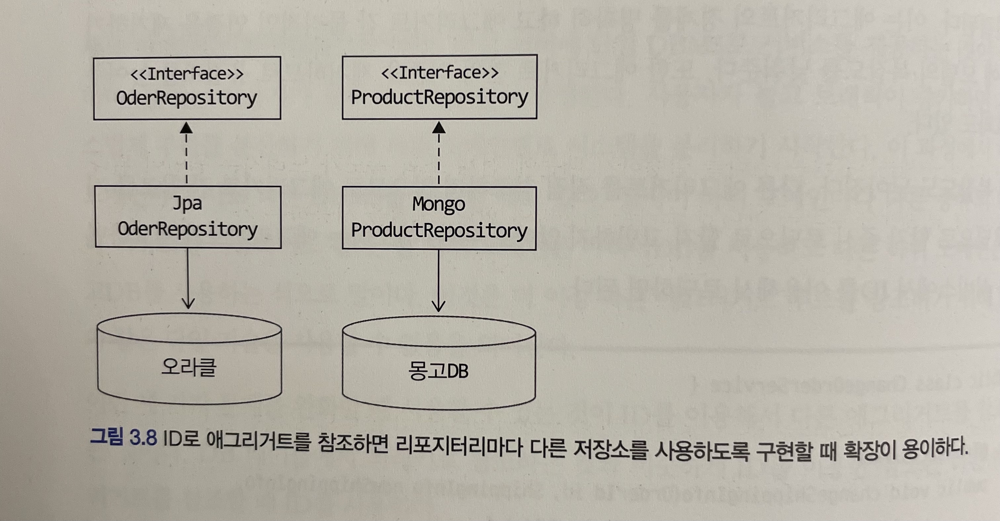

# 도베인 주도 개발 시작하기 : DDD 핵심 개념 정리부터 구현까지

- 정리 범위
  - Chapter 3 애그리거트 : 3.2 ~ 3.4

## 3.2 애그리거트 루트

애그리거트 루트

- 애그리거트에 속한 모든 객체가 일관된 상태를 유지하기 위한 애그리거트 전체를 관리할 주체
- 애그리거트의 대표 엔티티
- 애그리거트에 속한 객체는 애그리거트 루트 엔티티에 직접 또는 간접적으로 속하게 됨



### 3.2.1 도메인 규칙과 일관성

애그리거트 루트의 핵심 역할

- 애그리거트의 일관성이 꺠지지 않도록 하는 것
- 이를 위해 애그리거트 루트는 애그리거트가 제공해야 할 도메인 기능을 구현한다.

예를 들어, 주문 애그리거트는 배송지 변경, 상품 변경과 같은 기능을 제공하고, 애그리거트의 루트인 Order가 이 기능을 구현한 메서드를 제공한다.

```java
public class Order {

    // 애그리거트 루트는 도메인 규칙을 구현한 기능을 제공한다.
    public void changeShippingInfo(ShippingInfo newShippingInfo) {
        verifyNotYetShipped();
        setShippingInfo(newShippingInfo);
    }

    private void verifyNotYetShipped() {
        if (state != OrderState.PAYMENT_WAITING && OrderState.PREPARING) {
            throw new IllegalStateException("already shipped");
        }
    }
}
```

아래와 같이, 애그리거트 외부에서 애그리거트에 속한 객체를 직접 변경하면 안된다.

```java
ShippingInfo si = order.getShippingInfo();
si.setAddress(newAddress);
```

- 주문 상태에 상관없이 배송지 주소를 변경하는데, 이는 업무 규칙을 무시하고 직접 DB 테이블의 데이터를 수정하는 것과 같은 결과를 만든다.

주문 상태를 확인하기 위해 다음 로직을 추가하였다.

```java
ShippingInfo si = order.getShippingInfo();

// 주요 도메인 로직이 중복되는 문제
if (state != OrderState.PAYMENT_WAITING && state != OrderState.PREPARING) {
    throw new IllegalArgumentException();
}
si.setAddress(newAddress);
```

- 해당 메소드는 외부에서 호출하기 때문에 주문 상태를 체크히는 로직이 중복으로 작성돈다.

불필요한 중복을 피하고 애그리거트 루트를 통해서만 도메인 로직을 구현하게 만들려면 도메인 모델에 대한 다음의 두 가지를 습관적으로 적용해야 한다.

- 단순히 필드를 변경하는 set 메서드를 공개(public) 범위로 만들지 않는다.
- 밸류 타입은 불변으로 구현한다.

#### 공개(public) set 메서드를 피해야 한다.

```java
// 도메인 모델에서 공개 set 메서드는 가급적 피해야 한다.
public void setName(String name) {
    this.name = name;
}
```

- 공개 set 메서드는 도메인의 의미나 의도를 표현하지 못하고 도메인 로직을 도메인 객체가 아닌 응용 영역이나 표현 영역으로 분산시킨다.
- 도메인 모델의 엔티티나 밸류에 공개 set 메서드만 넣지 않아도 일관성이 깨질 가능성이 줄어든다.

#### 밸류는 불변타입으로 구현한다.

```java
ShippingInfo si = order.getShippingInfo();
si.setAddress(newAddress); // ShippingInfo가 불변이면, 이 코드는 컴파일 에러!
```

- 애그리거트 외부에서 내부 상태를 함부로 바꾸지 못하므로 애그리거트의 일관성이 꺠질 가능성이 줄어든다. 밸류 객체가 불변이면 밸류 객체의 값을 변경하는 방법은 새로운 밸류 객체를 할당하는 것뿐이다.

```java
public class Order {
    private ShippingInfo shippingInfo;

    public void changeShippingInfo(ShippingInfo newShippingInfo) {
        verifyNotYetShipped();
        setShippingInfo(newShippingInfo);
    }

    // set 메서드의 접근 허용 범위는 private이다.
    private void setShippingInfo(ShippingInfo newShippingInfo) {
        // 밸류가 불변이면 새로운 객체를 할당해서 값을 변경해야 한다.
        // 불변이므로 this.shippingInfo.setAddress(newShippingInfo.getAddress()) 와 같은 코드를 사용할 수 없다.
        this.shippingInfo = newShippingInfo;
    }
}
```

밸류 타입의 내부 상태를 변경하려면 애그리거트 루트를 통해서만 가능하다. 그러므로 애그리거트 루트가 도메인 규칙을 올바르게만 구현하면 애그리거트 전체의 일관성을 올바르게 유지할 수 있다.

### 3.2.2 애그리거트 루트의 기능 구현

#### 객체 조합

애그리거트 루트는 애그리거트 내부의 다른 객체를 조합해서 기능을 완성한다.

Order 도메인

- Money 객체와 OrderLine 객체

```java
public class Order {
    private Money totalAmounts;
    private List<OrderLine> orderLines;

    private void calculateTotalAmounts() {
        int sum = orderLines.stream()
                .mapToInt(ol -> ol.getPrice() * ol.getQuantity())
                .sum();
        this.totalAmounts = new Money(sum);
    }
}
```

Member 도메인

- Password 객체

```java
public class Member {
    private Password password;

    public void changePassword(String currentPassword, String newPassword) {
        if (!password.match(currentPassword)) {
            throw new PasswordNotMatchException();
        }
        this.password = new Password(newPassword);
    }
}
```

#### 기능 실행 위임

애그리거트 루트가 구성요소의 상태만 참조하는 것은 아니다. 기능 실행을 위임하기도 한다.

- 구현 기술의 제약이나 내부 모델링 규칙 때문에 OrderLine 목록을 별로 클래스로 분리했다고 해보자.

```java
public class OrderLine {
    private List<OrderLine> orderLine;

    public Money getTotalAmounts() { ...구현; }
    public void changeOrderLines(List<OrderLine> newLines) {
        this.lines = newLine;
    }
}
```

- 이 경우 Order의 changeOrderLines() 메서드는 다음과 같이 내부의 orderLines 필드에 상태 변경을 위임하는 방식으로 기능을 구현한다.

```java
public class Order {
    private OrderLines orderLines;

    public void changeOrderLines(List<OrderLine> newLines) {
        orderLines.changeOrderLines(newLine);
        this.totalAmounts = orderLines.getTotalAmount();
    }
}
```

- OrderLines는 changeOrderLines() 와 getTotalAmounts() 같은 기능을 제공하고 있다.
- 만약 Order가 getOrderLines() 와 같이 OrderLines 를 구할 수 있는 메서드를 제공하면 애그리거트 외부에서 OrderLines의 기능을 실행할 수 있게 된다.

```java
OrderLines lines = order.getOrderLines();

// 외부에서 애그리거트 내부 상태 변경!
// order의 totalAmounts가 값이 OrderLines가 일치하지 않게 됨
lines.changeOrderLines(newOrderLines);
```

- 이 코드는 주문의 OrderLines 목록이 바뀌는데 총합은 계산하지 않는 버그를 만든다.
- 이런 버그가 생기지 않도록 하려면 애초에 애그리거트 외부에서 OrderLine 목록을 변경할 수 없도록 OrderLine를 불변으로 구현하면 된다.

팀 표준이나 구현 기술의 제약으로 OrderLines를 불변으로 구현할 수 없다면?

- OrderLines의 변경 기능을 패키지나 protected 범위로 한정해서 외부에서 실행할 수 없도록 제한하는 방법도 있다.

보통 한 애그리거트에 속하는 모델은 한 패키지에 속하기 때문에 패키지나 protected 범위를 사용하면 애그리거트 외부에서 상태 변경 기능을 실행하는 것을 방지할 수 있다.

### 3.2.3 트랜잭션 범위

한 트랜잭션에서 한 애그리거트만 수정한다는 것은 애그리거트에서 다른 애그리거트를 변경하지 않는다는 것을 의미한다.

```java
public class Order {
    private Orderer orderer;

    public void shipTo(ShippingInfo newShippingInfo, boolean useNewShippingInfoAddrAsMemberAddr) {
        verifyNotYetShipped();
        setShippingInfo(newShippingInfo);
        if (useNewShippingInfoAddrAsMemberAddr) {
            // 다른 애그리거트의 상태를 변경하면 안 됨!
            orderer.getMember().changeAddress(useNewShippingInfoAddrAsMemberAddr);
        }
    }
}
```

- 애그리거트는 최대한 서로 독립적이어야 하는데 한 애그리거트가 다른 애그리거트의 기능에 의존하기 시작하면 애그리거트 간 결합도가 높아진다. 
- 결합도가 높아지면 높아질수록 향후 수정 비용이 증가하므로 애그리거트에서 다른 애그리거트의 상태를 변경하지 말아야 한다.

한 트랜잭션으로 두 개 이상의 애그리거트를 수정해야 한다면 애그리거트에서 다른 애그리거트를 직접 수정하지 말고 응용 서비스에서 두 애그리거트를 수정하도록 구현해야 한다.

```java
public class ChangeOrderService {
    // 두 개 이상의 애그리거트를 변경해야 하면,
    // 응용 서비스에서 각 애그리거트의 상태를 변경한다.
    @Transactional
    public void changeShippingInfo(OrderId id, ShippingInfo newShippingInfo, boolean useNewShippingAddrAsMemberAddr) {
        Order order = orderRepository.findById(id);
        if (order == null) throw new OrderNotFoundException();
        order.shipTo(newShippingInfo);
        if (useNewShippingAddrAsMemberAddr) {
            Member member = findMember(order.getOrderer);
            member.changeAddress(newShippingInfo.getAddress());
        }
    }
}
```

- 도메인 이벤트를 사용하면 한 트랜잭션에서 한 개의 애그리거트를 수정하면서도 동기나 비동기로 다른 애그리거트의 상태를 변경하는 코드를 작성할 수 있다.

## 3.3 리포지터리와 애그리거트

애그리거트는 개념상 완전한 한 개의 도메인 모델을 표현하므로 객체의 영속성을 처리하는 리포지터리는 애그리거트 단위로 존재한다.

- Order와 OrderLine을 물리적으로 각각 별도의 DB 테이블에 저장한다고 해서 Order와 OrderLine을 위한 리포지터리를 각각 만들지 않는다.
- Order가 애그리거트 루트고 OrderLine은 애그리거트에 속하는 구성요소이므로 Order를 위한 리포지터리만 존재한다.

```text
save : 애그리거트 저장
findById : ID로 애그리거트를 구함
```

애그리거트는 개념적으로 하나이므로 리포지터리는 애그리거트 전체를 저장소에 영속화해야 한다.

- Order 애그리거트와 관련된 테이블이 세 개라면 Order 애그리거트를 저장할 때 애그리거트 루트와 매핑되는 테이블뿐만 아니라 애그리거트에 속한 모든 구성요소에 매핑된 테이블에 데이터를 저장해야 한다.

```java
// 리포지터리에 애그리거트를 저장하면 애그리거트 전체를 영속화해야 한다.
orderRepository.save(order);
```

동일하게 애그리거트를 구하는 리포지터리 메서드는 완전한 애그리거트를 제공해야 한다.

```java
// 리포지터리는 완전한 Order를 제공해야 한다.
Order order = orderRepository.findById(orderId);

// order가 온전한 애그리거트가 아니면
// 기능 실행 도중 NullPointerException과 같은 문제가 발생한다.
order.cancel();
```

- 리포지터리가 완전한 애그리거트를 제공하지 않으면 필드나 값이 올바르지 않아 애그리거트의 기능을 실행하는 도중에 NullPointerException과 같은 문제가 발생할 수 있다.

애그리거트를 영속화할 저장소로 무엇을 사용하든지 간에 애그리거트의 상태가 변경되면 모든 변경을 원자적으로 저장소에 반영해야 한다.

- RDBMS를 이용해서 리포지터리를 구현하면 트랜잭션을 이용해서 애그리거트의 변경이 저장소에 반영되는 것을 보장할 수 있다. 
- 몽고 DB를 사용하면 한 개 애그리거트를 한 개 문서에 저장함으로써 한 애그리거트의 변경을 손실 없이 저장소에 반영할 수 있다.

## 3.4 ID를 이용한 애그리거트 참조

한 객체가 다른 객체를 참조하는 것처럼 애그리거트도 다른 애그리거트를 참조한다. 

- 애그리거트 관리 주체는 애그리거트 루트
- 애그리거트에서 다른 애그리거트를 참조한다는 것은 다른 애그리거트의 루트를 참조한다는 것



- 주문 애그리거트에 속해 있는 Orderer는 주문한 회원을 참조하기 위해 회원 애그리거트 루트인 Member를 필드로 참조할 수 있다.

JPA는 @ManyToOne, @OneToOne과 같은 애너테이션을 이용해서 연관된 객체를 로딩하는 기능 제공한다.
그 중 필드를 이용한 애그리거트 참조는 다음 문제를 야기할 수 있다.

- 편한 탐색 오용
- 성능에 대한 고민
- 확장 어려움


### 편한 탐색 오용

애그리거트를 직접 참조할 때 발생할 수 있는 가장 큰 문제는 편리함을 오용할 수 있다.

```java
public class Order {
    private Orderer orderer;

    public void shipTo(ShippingInfo newShippingInfo, boolean useNewShippingInfoAddrAsMemberAddr) {

        // 한 애그리거트 내부에서 다른 애그리거트에 접근할 수 있으면,
        // 구현이 쉬워진다는 것 때문에 다른 애그리거트의 상태를 변경하는 유혹에 빠지기 쉽다.
        if (useNewShippingInfoAddrAsMemberAddr) {
            orderer.getMember().changeAddress(useNewShippingInfoAddrAsMemberAddr);
        }
    }
}
```

### 성능에 대한 고민

애그리거트를 직접 참조하면 성능과 관련된 여러 가지 고민을 해야 한다는 것이다.

- 즉시 로딩
  - 단순히 연관된 객체의 데이터를 함께 화면에 보여줘야 하는 경우
- 지연 로딩
  - 애그리거트의 상태를 변경하는 기능을 싫행하는 경우

### 확장 어려움

사용자가 늘고 트래픽이 증가하면서 자연스럽게 부하를 분산하기 위해 하위 도메인별로 시스템을 분리하기 시작한다.

### ID 참조

세 가지 문제를 완화할 때 사용할 수 있는 것이 ID를 이용해서 다른 애그리거트를 참조하는 것이다.



ID 참조를 사용하면 모든 객체가 참조로 연결되지 않고 한 애그리거트에 속한 객체들만 참조로 연결된다.

```java
public class ChangeOrderService {
    @Transactional
    public void changeShippingInfo(OrderId id, ShippingInfo newShippingInfo, boolean useNewShippingAddrAsMemberAddr) {
        Order order = orderRepository.findById(id);
        if (order == null) throw new OrderNotFoundException();
        order.shipTo(newShippingInfo);
        if (useNewShippingAddrAsMemberAddr) {
            // ID를 이용해서 참조하는 애그리거트를 구한다.
            Member member = memberRepository.findById(order.getOrderer().getMemberId());
            member.changeAddress(newShippingInfo.getAddress());
        }
    }
```

- ID를 이용한 참조 방식을 사용하면 복잡도를 낮추는 것과 함께 한 애그리거트에서 다른 애그리거트를 수정하는 문제를 근원적으로 방지할 수 있다.

애그리거트별로 다른 구현 기술을 사용하는 것도 가능해진다.

- 중요한 데이터인 주문 애그리거트는 RDBMS에 저장
- 조회 성능이 중요한 상품 애그리거트는 NOSQL에 저장
- 각 도메인을 별도 프로세스로 서비스하도록 구현



### 3.4.1 ID를 이용한 참조와 조회 성능

주문 목록을 보여주려면 상품 애그리거트와 회원 애그리거트를 함께 읽어야 하는데, 이를 처리할 때 다음과 같이 각 주문마다 상품과 회원 애그리거트를 읽어온다고 해보자.
- 한 DBMS에 데이터가 조인을 이용해서 한 번에 모든 데이터를 가져올 수 있음에도 불구하고 주문마다 상품 정보를 읽어오는 쿼리를 실행하게 된다.

```java
Member member = memberRepository.findById(ordererId);
List<Order> orders = orderRepository.findByOrderer(ordererId);
List<OrderView> dtos = orders.stream()
        .map(order -> {
            ProductId prodId = order.getOrderLines().get(0).getProductId();
            // 각 주문마다 첫 번째 주문 상품 정보 로딩 위한 쿼리 실행
            Product product = productRepository.findById(prodId);
            return new OrderView(order, member, product);
        }).collect(toList());
```

- 위 코드는 주문 개수가 10개면 주문을 읽어오기 위한 1번의 쿼리와 주문별로 각 상품을 읽어오기 위한 10번의 쿼리를 실행한다.
- `조회 대상이 N개일 때 N개를 읽어오는 한 번의 쿼리와 연관된 데이터를 읽어오는 쿼리를 N번 실행한다` 해서 이를 N + 1 조회 문제라고 부른다.

N + 1 조회 문제는 더 많은 쿼리를 실행하기 때문에 전체 조회 속도가 느려지는 원인이 된다.
조인을 사용하는 가장 쉬운 방법은 ID 참조 방식을 객체 참조 방식으로 바꾸고 즉시 로딩을 사용하도록 매핑 설정을 바꾸는 것이다.

ID 참조 방식을 사용하면서 N + 1 조회와 같은 문제가 발생하지 않도록 하려면 조회 전용 쿼리를 사용하면 된다.

- 데이터 조회를 위한 별도 DAO를 만들고 DAO의 조회 메서드에서 조인을 이용해 한 번의 쿼리로 필요한 데이터를 로딩하면 된다.

```java
@Repository
public class JpaOrderViewDao implements OrderViewDao {
    @PersistenceContext
    private EntityManager em;

    @Override
    public List<OrderView> selectByOrderer(String ordererId) {
        String selectQuery = 
                "select new com.myshop.order.application.dto.OrderView(o, m, p) "+
                "from Order o join o.orderLines ol, Member m, Product p " +
                "where o.orderer.memberId.id = :ordererId "+
                "and o.orderer.memberId = m.id "+
                "and index(ol) = 0 " +
                "and ol.productId = p.id "+
                "order by o.number.number desc";
        TypeQuery<OrderView> query = 
                em.createQuery(selectQuery, OrderView.class);
        query.setParameter("ordererId", ordererId);
        return query.getResultList();
    }
}
```

- 해당 JPQL은 Order 애그리거트와 Member 애그리거트 그리고 Product 애그리거트를 조인으로 조회하여 한 번의 쿼리로 로딩한다.
- 즉시 로딩이나 지연 로딩과 같은 로딩 전략을 고민할 필요 없이 조회 화면에서 필요한 애그리거트 데이터를 한 번의 쿼리로 로딩할 수 있다.

애그리거트마다 서로 다른 저장소를 사용하면 한 번의 쿼리로 관련 애그리거트를 조회할 수 없다.

- 조회 성능을 높이기 위해 캐시를 적용하거나 조회 전용 저장소를 따로 구성한다.
- 이 방법은 코드가 복잡해지는 단점이 있지만 시스템의 처리량을 높일 수 있다는 장점이 있다.
- 특히 한 대의 DB 장비로 대응할 수 없는 수준의 트래픽이 발생하는 경우 캐시나 조회 전용 저장소는 필수로 선택해야 하는 기법이다.

## 정리

- 애그리거트 루트의 핵심 역할은 애그리거트의 일관성이 꺠지지 않도록 하는 것이며 이를 위해 애그리거트 루트는 애그리거트가 제공해야 할 도메인 기능을 구현한다.
- 불필요한 중복을 피하고 애그리거트 루트를 통해서만 도메인 로직을 구현하게 만들려면 도메인 모델에 대한 다음의 두 가지를 습관적으로 적용해야 한다.
  - 단순히 필드를 변경하는 set 메서드를 공개(public) 범위로 만들지 않는다.
  - 밸류 타입은 불변으로 구현한다.
- 애그리거트 루트는 애그리거트 내부의 다른 객체를 조합해서 기능을 완성하며 해당 기능을 위임하기도 한다.
- 한 트랜잭션에서 한 애그리거트만 수정한다는 것은 애그리거트에서 다른 애그리거트를 변경하지 않는다는 것을 의미한다.
- 한 트랜잭션으로 두 개 이상의 애그리거트를 수정해야 한다면 애그리거트에서 다른 애그리거트를 직접 수정하지 말고 응용 서비스에서 두 애그리거트를 수정하도록 구현해야 한다.
- 애그리거트는 개념상 완전한 한 개의 도메인 모델을 표현하므로 객체의 영속성을 처리하는 리포지터리는 애그리거트 단위로 존재한다.
- ID를 이용한 참조 방식을 사용하면 복잡도를 낮추는 것과 함께 한 애그리거트에서 다른 애그리거트를 수정하는 문제를 근원적으로 방지할 수 있다.
