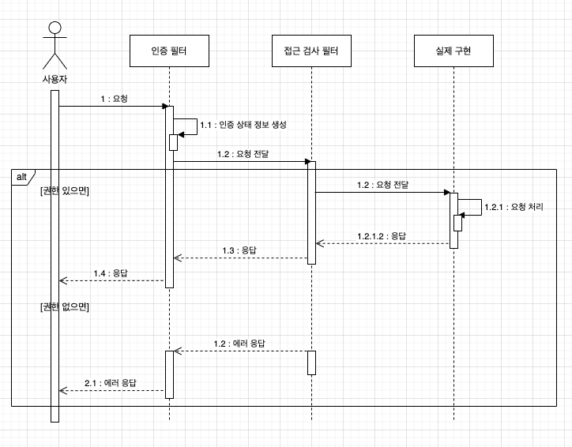
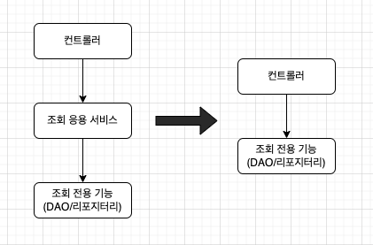
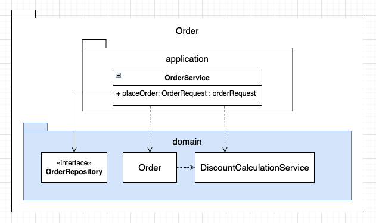

# 도메인 주도 개발 시작하기 : DDD 핵심 개념 정리부터 구현까지

- 정리 범위
  - Chapter 3 애그리거트 : 6.5 ~ 7.2

## 6. 응용 서비스와 표현 영역

### 6.5 값 검증

- 값 검증은 표현 영역과 응용 서비스 두 곳에서 모두 수행 가능
- 원칙적으로 모든 값에 대한 검증은 응용 서비스에서 처리

```java
public class JoinService {
    @Transactional
    public void join(JoinRequest request) {
        // 값의 형식 검사
        checkEmpty(request.getId(), "id");
        checkEmpty(request.getName(), "name");
        checkEmpty(request.getPassword(), "password");
        if (request.getPassword().equals(request.getConfirmPassword())) {
            throw new InvalidPropertyException("confirmPassword");
        }

        // 로직 검사
        checkDuplicateId(request.getId());
        ...
    }

    private void checkEmpty(String value, String propertyName) {
        if (value == null || value.isEmpty()) {
            throw new EmptyPropertyException(propertyName);
        }
    }

    private void checkDuplicateId(String id) {
        int count = memberRepository.countsById(id);
        if (count > 0) throw new DuplicateIdException();
    }
}
```

- 회원 가입을 처리하는 응용 서비스는 파라미터로 전달받은 값이 올바른지 검사
  - 1차적으로 값의 형식을 검사
    - 빈 값, 일치 여부, 포맷 등
  - 2차적으로 로직 검사

#### 응용 서비스의 값 검증

- 각 값이 유효한지 확인할 목적으로 익셉션을 사용할 때의 문제점은 사용자에게 좋지 않은 경험을 제공한다
- 입력한 값이 잘못되었을 경우 한 개 항목이 아닌 모든 항목에 대해 잘못된 값이 존재하는지 알고 싶어함
  - 응용 서비스에서 값을 검사하는 시점에 첫 번째 값이 올바르지 않아 익셉션을 발생시키면 나머지 항목에 대해서는 값을 검사하지 않게 된다.
  - 사용자 불편을 해소하기 위해 응용 서비스에서 에러 코드를 모아 하나의 익셉션으로 발생시키는 방법도 있다.

다음은 에러 코드를 모아 하나의 익셉션으로 발생시키는 예시이다.

```java
@Transactional
public OrderNo placeOrder(OrderRequest request) {
    List<ValidationError> errors = new ArrayList<>();
    if (request == null) {
        errors.add(ValidationError.of("empty"));
    } else {
        if (request.getOrdererMemberId() == null) {
            errors.add(ValidationError.of("ordererMemberId", "empty"))
        }
        if (request.getOrderProducts() == null) {
            errors.add(ValidationError.of("orderProducts", "empty"))
        }
        if (request.getOrderProducts().isEmpty()) {
            errors.add(ValidationError.of("orderProducts", "empty"))
        }
    }
    // 응용 서비스가 입력 오류를 하나의 익셉션으로 모아서 발생
    if (!errors.isEmpty()) throw new ValidationErrorException(errors);
}
```

#### 표현 영역의 값 검증

- 잘못된 값이 존재하면 이를 사용자에게 알려주고 값을 다시 입력받아야 한다. 
- 스프링 MVC는 폼에 입력한 값이 잘못된 경우 에러 메시지를 보여주기 위한 용도로 Errors나 BindingResult를 사용한다.

##### 조금 번잡한 코드

컨트롤러에서 폼에 에러 메시지를 보여주기 위해서는 다음과 같이 작성해야 한다.

```java
@Contoller
public class Controller {
    @PostMapping("/member/join")
    public String join(JoinRequest request, Errors errors) {
        try {
            joinService.join(request);
            return successView;
        } catch(EmptyPropertyException ex) {
            // 표현 영역은 잘못 입력한 값이 존재하면 이를 사용자에게 알려주고 폼을 다시 입력할 수 있도록 하기 위해 관련 기능 사용
            errors.rejectValue(ex.getPropertyName(), "empty");
            return formView;
        } catch(InvalidPropertyException ex) {
            errors.rejectValue(ex.getPropertyName(), "invalid");
            return formView;
        } catch(DuplicateIdException ex) {
            errors.rejectValue(ex.getPropertyName(), "duplicate");
            return formView;
        }
    }
}
```

##### 응용 서비스 에러 처리

표현 영역은 응용 서비스가 ValidationErrorException을 발생시키면 다음 코드처럼 익셉션에서 에러 목록을 가져와 표현 영역에서 사용할 형태로 변환 처리한다.

```java
@PostMapping("/orders/order")
public String order(@ModelAttribute("orderReq") OrderRequest orderRequest, BindingResult bindingResult, ModelMap modelMap) {
    User user = (User) SecurityContextHolder.getContext().getAuthentication().getPrincipal();
    orderRequest.setOrdererMemberId(MemberId.of(user.getUserName()));
    try {
        OrderNo orderNo = placeOrderService.placeOrder(orderRequest);
        modelMap.addAttribute("orderNo", orderNo.getNumber());
    } catch (ValidationErrorException e) {
        // 응용 서비스가 발생시킨 검증 에러 목록을 뷰에서 사용할 형태로 변환
        e.getErrors().forEach(err -> {
            if (err.hasName()) {
                bindingResult.rejectValue(err.getName().err.getCode());
            } else (
                bindingResult.reject(err.getCode());
            )
        });
        populateProductsModel(orderRequest, modelMap);
        return "order/confirm";
    }
} 
```

##### 표현 영역에서 필수 값 검증 방법

```java
@Controller
public class Controller {
    @PostMapping("/member/join")
    public String join(JoinRequest joinRequest, Errors error) {
        checkEmpty(joinRequest.getId(), "id", erros);
        checkEmpty(joinRequest.getName(), "name", erros);
        // 나머지 값 검증

        // 모든 값의 형식을 검증한 뒤, 에러 존재하면 다시 폼을 보여줌
        if (errors.hasError()) return formView;

        try {
            joinService.join(joinRequest);
            return successView;
        } catch(DuplicateIdException ex) {
            errors.rejectValue(ex.getPropertyName(), "duplicate");
            return formView;
        }
    }
}
```

스프링과 같은 프레임워크는 값 검증을 위한 Validator 인터페이스를 별도로 제공하여 위 코드를 다음과 같이 간결하게 줄일 수 있다.

```java
@Controller
public class Controller {
    @PostMapping("/member/join")
    public String join(JoinRequest joinRequest, Errors error) {
        new JoinRequestsValidator().validate(joinRequest.errors);
        if (errors.hasError()) return formView;

        try {
            joinService.join(joinRequest);
            return successView;
        } catch(DuplicateIdException ex) {
            errors.rejectValue(ex.getPropertyName(), "duplicate");
            return formView;
        }
    }
}
```

#### 정리

- 표현 영역에서 필수 값과 값의 형식을 검사
- 응용 서비스는 ID 중복 여부와 같은 논리적 오류만 검사 
- 즉 표현 영역과 응용 서비스가 값 검사를 나눠서 수행 

응용 서비스를 사용하는 표현 영역 코드가 한 곳이면 구현의 편리함을 위해 다음과 같이 역할을 나누어 검증을 수행할 수도 있다.

- 표현 영역 : 필수 값, 값의 형식, 범위 등을 검증한다.
- 응용 서비스 : 데이터의 존재 유무와 같은 논리적 오류를 검증한다.

> 참고
> 저자는 응용 서비스에서 필수 값 검증과 논리적인 검증을 모두 하는 편이다.

### 6.6 권한 검사

보안 프레임워크의 복잡도를 떠나 보통 다음 세 곳에서 권한 검사를 수행할 수 있다.

- 표현 영역
- 응용 서비스
- 도메인

표현 영역에서 할 수 있는 기본적인 검사는 인증된 사용자인지 아닌지 검사하는 것이다.

- 대표적인 예가 회원 정보 변경 기능이다.
- URL을 처리하는 컨트롤러에 웹 요청을 전달하기 전에 인증 여부를 검사해서 인증된 사용자의 웹 요청만 컨트롤러에 전달한다.
- 인증된 사용자가 아닐 경우 로그인 화면으로 리다이렉트 시킨다.



URL 만으로 접근 제어를 할 수 없는 경우 응용 서비스의 메서드 단위로 권한 검사를 수행해야 한다. 이것이 꼭 응용 서비스의 코드에서 직접 권한 검사를 해야 한다는 것을 의미하는 것은 아니다.

- 예를 들어 스프링 시큐리티는 AOP를 활용해서 다음과 같이 애너테아션으로 서비스 메서드에 대한 권한 검사를 할 수 있는 기능을 제공한다.

```java
public class BlockMemberService {
    private MemberRepository memberRepository;

    @PreAuthorize("hasRole('ADMIN')")
    public void block(String memberId) {
        Member member = memberRepository.findById(memberId);
        if (member == null) throw new NoMemberException();
        member.block();
    }
}
```

개별 도메인 객체 단위로 권한 검사를 해야 하는 경우는 구현이 복잡해진다.

- 예를 들어 게시글 삭제는 본인 또는 관리자 역할을 가진 사용자만 할 수 있다고 해보자

응용 서비스의 메소드 수준에서 권한 검사를 할 수 없기 때문에 다음과 같이 직접 권한 검사 로직을 구현해야 한다.

```java
public class DeleteArticleService {
    public void delete(String userId, Long articleId) {
        Article article = articleRepository.findById(articleId);
        checkArticleExistence(article);
        permissionService.checkDeletePermission(userId, article);
        article.markDeleted();
    }
}
```

#### 정리

- 스프링 시큐리티와 같은 보안 프레임워크를 확장해서 개별 도메인 객체 수준의 권한 검사 기능을 프레임워크에 통합할 수도 있다. 
- 도메인 객체 수준의 권한 검사 로직은 도메인별로 다르므로 도메인에 맞게 보안 프레임워크를 확장하려면 프레임워크에 대한 높은 이해가 필요하다.
- 보안 프레임워크에 대한 이해도가 높지 않다면 도메인에 맞는 권한 검사 기능을 직접 구현하는 것이 코드 유지 보수에 유리하다.

### 6.7 조회 전용 기능과 응용 서비스

조회 화면을 위한 조회 전용 모델과 DAO를 만드는 내용을 통해서 서비스에서 이들 조회 전용 기능을 사용하면 서비스 코드가 다음과 같이 단순히 조회 전용 기능을 호출하는 형태로 끝난다.

다음은 응용 서비스에서 특정 주문자에 해당하는 주문 목록을 조회하는 전용 기능 예시이다.

```java
public class OrderListService {

    public List<OrderView> getOrderList(String ordererId) {
        return orderViewDao.selectByOrderer(ordererId);
    }
}
```

- 서비스에서 수행하는 추가적인 로직이 없다. 
- 단일 쿼리만 실행하는 조회 전용 기능이어서 트랜잭션이 필요하지도 않다. 
- 이 경우라면 굳이 서비스를 만들 필요 없이 표현 영역에서 바로 조회 전용 기능을 사용해도 문제가 없다.



#### 정리 

- 응용 서비스가 사용자 요청 기능을 실행하는 데 별다른 기여를 하지 못한다면 굳이 서비스를 만들지 않아도 된다.

## 7. 도메인 서비스

### 7.1 여러 애그리거트가 필요한 기능

도메인 영역의 코드를 작성하다 보면, 한 애그리거트로 기능을 구현할 수 없을 때가 있다.

- 대표적인 예가 결제 금액 계산 로직이다.

```text
- 상품, 주문, 할인 쿠폰, 회원 애그리거트 등이 있다.
- 이 상황에서 실제 결제 금액을 계산해야 하는 주체는 어떤 애그리거트일까?
- 총 주문 금액을 계산하는 것은 주문 애그리거트가 할 수 있지만 실제 결제 금액은 이야기가 다르다
- 총 주문 금액에서 할인 금액을 계산해야 하는데 이 할인 금액을 구하는 것은 누구 책임일까?
- 할인 쿠폰이 할인 규칙을 갖고 있으니 할인 쿠폰 애그리거트가 계산해야 할까?
- 할인 쿠폰을 두 개 이상 적용할 수 있다면 단일 할인 쿠폰 애그리거트로는 총 결제 금액을 계산할 수 없다.
```

먼저, 생각해볼 수 있는 방법은 주문 애그리거트가 필요한 데이터를 모두 가지도록 한 뒤 할인 금액 계산 책임을 주문 애그리거트에 할당하는 것이다.

다음은 주문 애그리거트에서 할인 금액 계산의 대한 책임을 할당한 예시이다.

```java
public class Order {
    ...
    private Orderer orderer;
    private List<OrderLine> orderLines;
    private List<Coupon> usedCoupons;

    private Money calculatePayAmounts() {
        Money totalAmounts = calculateTotalAmounts();
        // 쿠폰 별로 할인 금액을 구한다.
        Money discount = coupons.stream()
                                .map(coupon -> calculateDiscount(coupon))
                                .reduce(Money(0), (v1, v2) -> v1.add(v2));
        // 회원에 따른 추가 할인을 구한다.
        Money membershipDiscount = calculateDiscount(orderer.getMember().getGrade());
        // 실제 결제 금액 계산
        return totalAmounts.minus(discount).minus(membershipDiscount);
    }

    private Money calculateDiscount(Coupon coupon) {
        // orderLines의 각 상품에 대해 쿠폰을 적용해서 할인 금액 계산하는 로직
        // 쿠폰의 적용 조건 등을 확인하는 코드
        // 정책에 따라 복잡한 if-else와 계산 코드
        ...
    }

    private Money calculateDiscount(MemberGrade grade) {
        // 등급에 따라 할인 금액 계산
    }
}
```

- 할인 정책은 주문 애그리거트가 갖고 있는 구성요소와는 관련이 없다
- 그러나 결제 금액 계산 책임이 주문 애그리거트에 있다는 이유로 주문 애그리거트의 코드를 수정해야 한다.

`한 애그리거트에 넣기 애매한 도메인 기능을 억지로 특정 애그리거트에 구현하면 안 된다.`

- 억지로 구현하면 애그리거트는 자신의 책임 범위를 넘어서는 기능을 구현하게 된다.
- 그래서 코드가 길어지고 외부에 대한 의존이 높아지게 되며 코드를 복잡하게 만들어 수정을 어렵게 만드는 요인이 된다.

이런 문제를 해소하는 가장 쉬운 방법은 도메인 기능을 별도 서비스로 구현하는 것이다.

### 7.2 도메인 서비스

도메인 서비스는 도메인 영역에 위치한 도메인 로직을 표현할 때 사용한다.

- 계산 로직 : 여러 애그리거트가 필요한 계산 로직이나, 한 애그리거트에 넣기에는 다소 복잡한 계산 로직
- 외부 시스템 연동이 필요한 도메인 로직 : 구현하기 위해 타 시스템을 사용해야 하는 도메인 로직

#### 7.2.1 계산 로직과 도메인 서비스

할인 금액 규칙 계산처럼 한 애그리거트에 넣기 애매한 도메인 개념을 구현하기 위한 방법

- 도메인 서비스 활용한다.
  - 도메인 서비스는 상태 없이 로직만 구현한다.
  - 도메인 서비스를 구현하는 데 필요한 상태는 다른 방법으로 전달 받는다.
- 애그리거트에 억지로 넣기보다는 도메인 서비스를 이용해서 도메인 개념을 명시적으로 드러내면 된다. 
- 응용 영역의 서비스가 응용 로직을 다룬다면 도메인 서비스는 도메인 로직을 다룬다.

할인 금액 계산 로직을 위한 도메인 서비스인 DiscountCalculationService 를 만든다.

- 도메인의 의미가 드러나는 용어를 타입과 메서드 이름으로 갖는다.

다음은 할인 금액 계산 로직을 담당하는 도메인 서비스 예시이다.

```java
public class DiscountCalculationService {

    public Money calculateDiscountAmounts(
        List<OrderLine> orderLines,
        List<Coupon> coupons,
        MemberGrade grade) {
            Money couponDiscount = 
                coupons.stream()
                        .map(coupon -> calculateDiscount(coupon))
                        .reduce(Money(0), (v1, v2) -> v1.add(v2));

            Money membershipDiscount = calculateDiscount(orderer.getMember().getGrade());

            return couponDiscount.add(membershipDiscount);
        }
    )

    private Money calculateDiscount(Coupon coupon) {
        ...
    }

    private Money calculateDiscount(MemberGrade grade) {
        ...
    }
}
```

- 할인 계산 서비스를 사용하는 주체는 애그리거트가 될 수도 있고 응용 서비스가 될 수도 있다.
- DiscountCalculationService를 다음과 같이 애그리거트의 결제 금액 계산 기능에 전달하면 사용 주체는 애그리거트가 된다.

다음은 할인 계산 서비스인 도메인 서비스를 주문 애그리거트에 전달하는 예시이다.

```java
public class Order {
    public void calculateAmounts(DiscountCalculationService disCalSvc, MemberGrade grade) {
        Money totalAmounts = getTotalAmounts();
        Money discountAmounts = disCalSvc.calculateDiscountAmounts(this.orderLines, this.coupons, grade);
        this.paymentAmounts = totalAmounts.minus(discountAmounts);
    }
}

public class OrderService {
    private DiscountCalculationService discountCalculationService;

    @Transactional
    public OrderNo placeOrder(OrderRequest request) {
        OrderNo orderNo = orderRepository.nextId();
        Order order = createOrder(orderNo, orderRequest);
        orderRepository.save(order);
        // 응용 서비스 실행 후 표현 영역에서 필요한 값 리턴
        return orderNo;
    }

    private Order createOrder(OrderNo orderNo, OrderRequest request) {
        Member member = findMember(request.getOrdererId());
        Order order = new Order(orderNo, request.getOrderLines(), request.getCoupons(), createOrderer(member), request.getShippingInfo());
        order.calculateAmounts(this.discountCalculationService, member.getGrade());
        return order;
    }
}
```

- 하지만 해당 방법은 `도메인 서비스 객체를 애그리거트에 주입하지 않기` 에서 다루지만 추천하지 않는다.

애그리거트 메서드를 실행할 때 도메인 서비스를 인자로 전달하지 않고 반대로 도메인 서비스의 기능을 실행할 때 애그리거트를 전달하기도 한다.

- 예를 들어, 계좌 이체에는 두 계좌 애그리거트가 관여하는데 한 애그리거트는 금액을 출금하고 한 애그리거트는 금액을 입금한다.
- 이를 위한 도메인 서비스는 다음과 같이 구현할 수 있다.

다음은 계좌 이체 서비스에서 출금과 입금의 대한 애그리거트를 처리하는 예시이다.

```java
public class TransferService {
    public void transfer(Account fromAcc, Account toAcc, Money amounts) {
        fromAcc.withdraw(amounts);
        toAcc.credit(amounts);
    }
}
```

##### 정리

- 도메인 서비스는 도메인 로직을 수행하지 응용 로직을 수행하진 않는다. 
- 트랜잭션 처리와 같은 로직은 응용 로직이므로 도메인 서비스가 아닌 응용 서비스에서 처리해야 한다.

> 참고
> 특정 기능이 응용 서비스인지 도메인 서비스인지 감을 잡기 어려울 때는 해당 로직이 애그리거트의 상태를 변경하거나 애그리거트의 상태 값을 계산하는지 검사해 보면 된다.

##### 도메인 서비스 객체를 애그리거트에 주입하지 않기

- 애그리거트의 메서드를 실행할 때 도메인 서비스 객체를 파라미터로 전달한다는 것은 애그리거트가 도메인 서비스에 의존한다는 것을 의미한다.

이것은 좋은 방법은 아니다.

- 도메인 객체는 필드(프로퍼티)로 구성된 데이터와 메서드를 이용해서 개념적으로 하나인 모델을 표현한다.
- 모델의 데이터를 담는 필드는 모델에서 중요한 구성요소다.
- 일부 기능을 위해 굳이 도메인 서비스 객체를 애그리거트에 의존 주입할 이유는 없다. 이는 프레임워크의 기능을 사용하고 싶은 개발자의 욕심을 채우는 것에 불과하다.

#### 7.2.2 외부 시스템 연동과 도메인 서비스

외부 시스템이나 타 도메인과의 연동 기능도 도메인 서비스가 될 수 있다.

- 예를 들어, 설문 조사 시스템과 사용자 역할 관리 시스템이 분리되어 있다고 하자.
- 설문 조사 시스템은 설문 조사를 생성할 때 사용자가 생성 권한을 가진 역할인지 확인하기 위해 역할 관리 시스템과 연동해야 한다.
- 시스템 간 연동은 HTTP API 호출로 이루어질 수 있지만 설문 조사 도메인 입장에서는 사용자가 설문 조사 생성 권한을 가졌는지 확인하는 도메인 로직으로 볼 수 있다.

다음은 설문 조사 권한의 대한 확인을 담당하는 도메인 로직의 대한 예시이다.

```java
public interface SurveyPermissionChecker {
    boolean hasUserCreationPermission(String userId);
}
```

- 이 도메인 로직은 도메인 서비스로 표현할 수 있다.
- 도메인 로직 관점에서 인터페이스를 작성하였다.
- 역할 관리 시스템과 연동한다는 관점으로 인터페이스를 작성하지 않았다.

응용 서비스는 이 도메인 서비스를 이용해서 생성 권한을 검사한다.

```java
public class CreateSurveyService {
    private SurveyPermissionChecker permissionChecker;

    public Long createSurvey(CreateSurveyRequest request) {
        validate(request);

        // 도메인 서비스를 이용해서 외부 시스템 연동을 표현
        if (!permissionChecker.hasUserCreationPermission(request.getRequestorId())) {
            throw new NoPermissionException();
        }
    }
}
```

- `SurveryPermissionChecker` 인터페이스를 구현한 클래스는 인프라스트럭처 영역에 위치해 연동을 포함한 권한 검사 기능을 구현한다.

#### 7.2.3 외부 시스템 연동과 도메인 서비스

도메인 서비스는 도메인 로직을 표현하므로 도메인 서비스의 위치는 다른 도메인 구성 요소와 동일한 패키지에 위치한다.



도메인 서비스의 개수가 많거나 엔티티나 밸류와 같은 다른 구성요소와 명시적으로 구분하고 싶다면 다음과 같이 위치시킬 수 있다.

- domain.model, domain.service, domain.repository

##### 정리

- 도메인을 표현하기 위해서 패키지 위치 및 이름을 활용할 수 있다.

#### 7.2.4 도메인 서비스의 인터페이스와 클래스

도메인 서비스의 로직이 고정되어 있지 않은 경우 도메인 서비스 자체를 인터페이스로 구현하고 이를 구현한 클래스를 둘 수도 있다. 특히 도메인 로직을 외부 시스템이나 별도 엔진을 이용해서 구현할 때 인터페이스와 클래스를 분리하게 된다.


##### 정리

- 도메인 서비스의 구현이 특정 구현 기술에 의존하거나 외부 시스템의 API를 실행한다면 도메인 영역의 도메인 서비스는 인터페이스로 추상화해야 한다. 
- 이를 통해 도메인 영역이 특정 구현에 종속되는 것을 방지할 수 있고 도메인 영역에 대한 테스트가 쉬워진다.