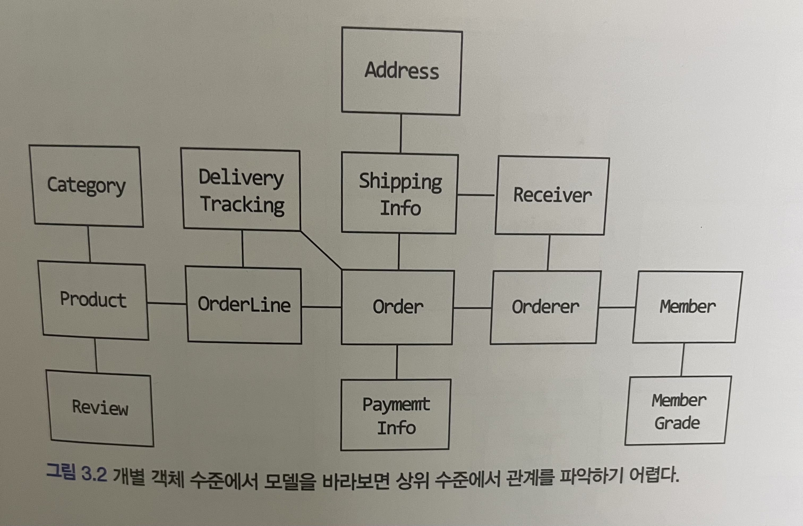
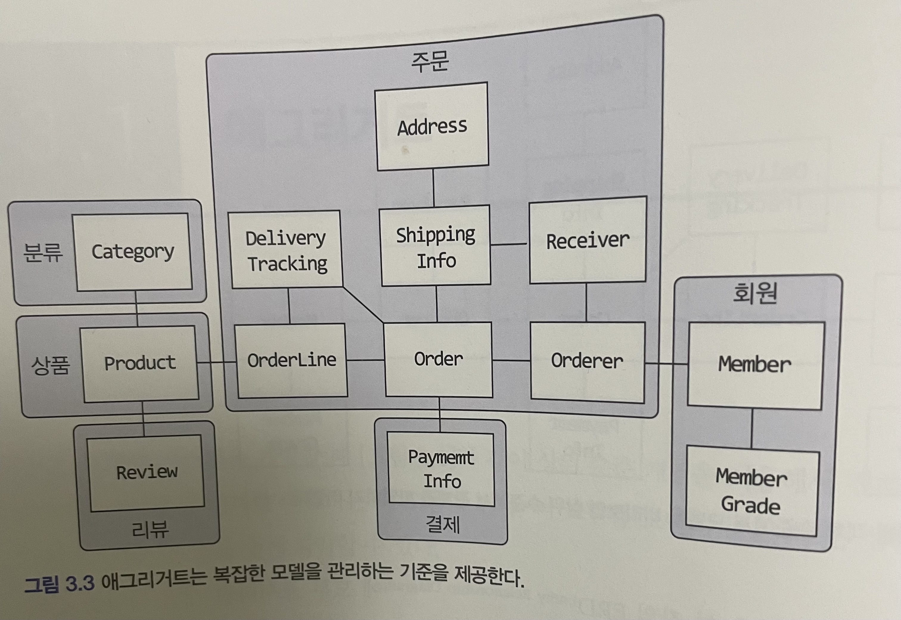
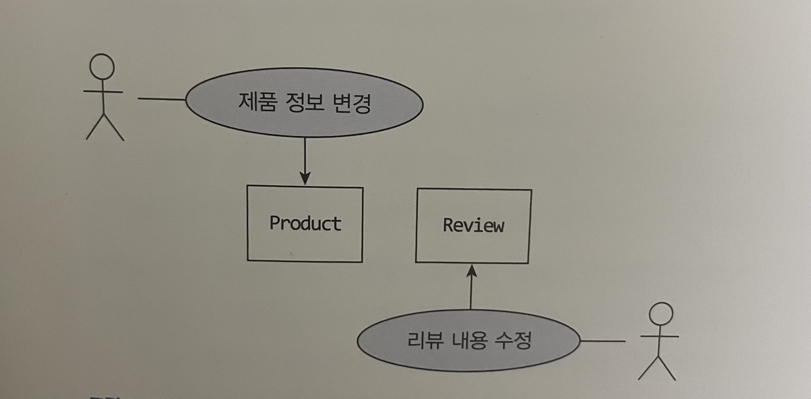

# 3.1 애그리거트


개별 객체 수준에서 모델을 바라보았을때에는 전반적인 구조, 큰 수준에서 도메인 간의 관계를 파악하기 어렵다.
코드를 작성하기 전에 상위 수준에서 모델이 어떻게 엮이는지 알아야 기존 모델을 깨트리지 않으면서 요구사항을 반영할 수 있는데 세부적인 모델 수준만을 이해한 상태로는 코드 수정이 쉽지않다.
그래서 세부적으로 이해한 관계를 쉽게 만들기 위해 상위 수준에서 모델을 바라볼 수 있어야 하는데 **애그리거트**가 이때 도움이 된다



애그리거트는 도메인 모델에서 관련된 객체들을 하나의 군으로 묶어주는 역할을 한다.
애그리거트로 묶인 모델들의 특징은

 - 모델을 애그리거트 단위로 묶었기 때문에 개별적으로 모델을 바라보는 것보다 이해하기 쉬워진다.
   - 이해하는데에 도움을 주고 일관성을 관리하는 기준이 된다
 - 한 애그리거트에 속한 객체는 유사하거나 동일한 라이프 사이클을 갖는다.
 - 한 애그리거트에 속한 객체는 다른 애그리거트에 속하지 않는다

## 애그리거트 경계 설정 시 주의사항
애그리거트간 경계를 설정할 때 기본이 되는 것은 **도메인 규칙과 요구사항**이다. 도메인 규칙에 따라 함께 생성되는 구성요소는 한 애그리거트에 속할 가능성이 높다
> 예를들어 주문을 생성할때 상품 개수, 배송지 정보, 주문자 정보는 주문시점에 생성되므로 한 애그리거트에 속하게 된다

```java
public class Order {
	private List<OrderLine> orderLineList;
	private ShippingInfo shippingInfo;
	private Orderer orderer;
	private Address address;
    
    ...
}

public class Address {
	private String address1;
	private String address2;
	private String zipCode;
	
    ...
}
```

---

'A가 B를 갖는다'로 설계할 수 있는 요구사항의 경우 두 모델을 한 애그리거트로 묶어서 생각하기 쉽지만 그럴수도 있고 아닐수도 있다.
예를 들어 상품(Product)과 리뷰(Review)는 위에서 설명한 애그리거트로 묶인 모델의 특징을 갖을 수 없다. 상품과 리뷰가 같은 애그리거트에 묶인다 할지라도 이 두 객체는 같이 생성되지 않고, 함께 변경되지 않는다.
또한 상품(상품 담당자)과 리뷰(상품을 구입한 고객)에 접근하는 주체가 서로 다르다. 따라서 **상품의 정보가 바뀌었다고 해서 리뷰의 정보가 바뀌지 않고 그 반대의 경우도 마찬가지**이다

그래서 이 둘은 서로 다른 애그리거트에 속한다.


