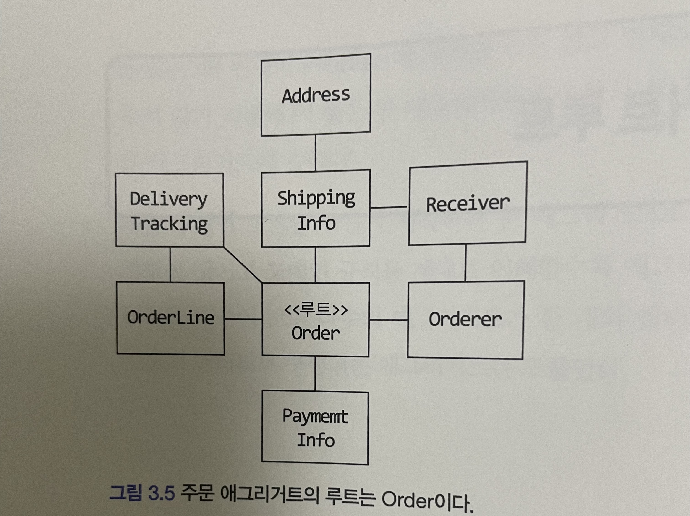
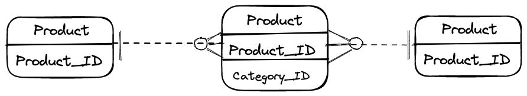

# 3.1 애그리거트


개별 객체 수준에서 모델을 바라보았을때에는 전반적인 구조, 큰 수준에서 도메인 간의 관계를 파악하기 어렵다.
코드를 작성하기 전에 상위 수준에서 모델이 어떻게 엮이는지 알아야 기존 모델을 깨트리지 않으면서 요구사항을 반영할 수 있는데 세부적인 모델 수준만을 이해한 상태로는 코드 수정이 쉽지않다.
그래서 세부적으로 이해한 관계를 쉽게 만들기 위해 상위 수준에서 모델을 바라볼 수 있어야 하는데 **애그리거트**가 이때 도움이 된다


애그리거트는 도메인 모델에서 관련된 객체들을 하나의 군으로 묶어주는 역할을 한다.
애그리거트로 묶인 모델들의 특징은

 - 모델을 애그리거트 단위로 묶었기 때문에 개별적으로 모델을 바라보는 것보다 이해하기 쉬워진다.
   - 이해하는데에 도움을 주고 일관성을 관리하는 기준이 된다
 - 한 애그리거트에 속한 객체는 유사하거나 동일한 라이프 사이클을 갖는다.
 - 한 애그리거트에 속한 객체는 다른 애그리거트에 속하지 않는다

## 애그리거트 경계 설정 시 주의사항
애그리거트간 경계를 설정할 때 기본이 되는 것은 **도메인 규칙과 요구사항**이다. 도메인 규칙에 따라 함께 생성되는 구성요소는 한 애그리거트에 속할 가능성이 높다
> 예를들어 주문을 생성할때 상품 개수, 배송지 정보, 주문자 정보는 주문시점에 생성되므로 한 애그리거트에 속하게 된다

```java
public class Order {
	private List<OrderLine> orderLineList;
	private ShippingInfo shippingInfo;
	private Orderer orderer;
	private Address address;
    
    ...
}

public class Address {
	private String address1;
	private String address2;
	private String zipCode;
	
    ...
}
```

---

'A가 B를 갖는다'로 설계할 수 있는 요구사항의 경우 두 모델을 한 애그리거트로 묶어서 생각하기 쉽지만 그럴수도 있고 아닐수도 있다.
예를 들어 상품(Product)과 리뷰(Review)는 위에서 설명한 애그리거트로 묶인 모델의 특징을 갖을 수 없다. 상품과 리뷰가 같은 애그리거트에 묶인다 할지라도 이 두 객체는 같이 생성되지 않고, 함께 변경되지 않는다.
또한 상품(상품 담당자)과 리뷰(상품을 구입한 고객)에 접근하는 주체가 서로 다르다. 따라서 **상품의 정보가 바뀌었다고 해서 리뷰의 정보가 바뀌지 않고 그 반대의 경우도 마찬가지**이다

그래서 이 둘은 서로 다른 애그리거트에 속한다.


# 3.2 애그리거트 루트
애그리거트는 여러 객체로 구성되기 때문에 한 객체만 상태가 정상이면 안된다. 여기서 말하는 정상은 일관성을 갖는다는 말이다.



 - 애그리거트에 속한 모든 객체가 일관된 상태를 가져야 한다
 - 애그리거트 전체를 관리할 주체가 바로 **애그리거트 루트**
 - 애그리거트에 속한 모델은 애그리거트 루트(Order)에 직접 또는 간접적으로 속하게 된다

## 3.2.1 도메인 규칙과 일관성
애그리거트 루트는 단순히 애그리거트에 속한 객체를 포함하는것으로 끝나지 않는다. **애그리거트의 일관성이 깨지지 않게 하는것이 핵심이다**. 도메인 규칙에 따라 애그리거트에 속한 객체의 일관성이 깨지지 않도록 구현해야한다.

일관성을 지키기 위해 애그리거트 외부에서 애그리거트에 속한 객체를 직접 변경해선 안된다. 외부에서 변경을 허용한다면 애그리거트 루트가 강제하는 규칙(도메인 규칙)을 적용할 수 없어 일관성을 깨는 원인이 된다. 일관성을 지키기 위해 애그리거트 루트를 통해서만 기능을 사용하게 해야한다.

애그리거트 루트를 통해서만 도메인 로직을 구현하게 하려면 도메인 모델에 두가지 습관을 적용해야 한다.
 - 단순히 필드를 변경하는 set 메서드를 public으로 만들지 않는다.
 - 밸류 타입은 불변으로 구현한다.

### 1. 필드를 변경하는 set 메서드를 public으로 두는 경우
```java
ShippingInfo si = order.getShippingInfo();
si.setAddress(newAddress);
```
배송지 정보를 바꾸기 위해서는 배송이 시작되기전 상품만 배송지 정보 변경이 가능한 도메인 규칙이 있다.
이 코드는 도메인 규칙을 무시하면서 ShippingInfo의 상태를 수정하는 결과를 만들게 되고 일관성이 깨지게 된다.

```java
// in Service..
ShippingInfo si = order.getShippingInfo();

if (state != OrderState.PAYMENT_WAITING && state != OrderState.PREPARING) {
	throw new IllegalException("배송지 정보를 변경 할 수 없습니다");
}

si.setAddress(newAddress);
```
또 다른 예시로 상태를 확인하는 로직을 서비스에 구현한 경우인데, 이렇게 되면 상태를 변경하기 위한 로직이 여러 서비스에 중복으로 구현되고 코드의 응집도(기능적 응집도)를 해쳐 유지보수에 도움이 되지 않는다

### 2. 밸류 타입은 불변으로 구현
밸류 객체를 불변으로 구현하면 애그리거트 루트에서 밸류 객체를 구해도 외부에서 밸류 객체의 상태를 변경 할 수 없다.
외부에서 밸류 객체를 변경하려면 새로운 밸류 객체를 생성하는 것 뿐이다.

```java
public class Order {
	private ShippingInfo shippingInfo;

	public void changeShippingInfo(ShippingInfo newShippingInfo) {
		verifyNotYetShipped();
		setShippingInfo(newShippingInfo);
	}

	private void setShippingInfo(ShippingInfo newShippingInfo) {
		this.shippingInfo = newShippingInfo;
	}
}
```
애그리거트 루트가 제공하는 메서드를 통해서만 배송지 정보를 변경하게 하였다. 도메인 규칙을 적용할 수 있게 되었고 외부에서 public setXXX 메서드를 사용하지 못하게 함으로써 애그리거트의 속한 객체의 일관성을 지키게 할 수 있다.


## 3.2.2 애그리거트 루트의 기능 구현
애그리거트 루트는 애그리거트 내부의 다른 객체를 조합해서 기능을 완성한다.

 - 구성요소의 상태를 참조
 - 애그리거트 내부 객체에게 기능을 위임

### 구성요소의 상태를 참조
```java
public class Order {
	private Money totalAmounts;
	private List<OrderLine> orderLines;

	private void calculateTotalAmounts() {
		int sum = orderLines.stream()
					.mapToInt(ol -> ol.getPrice() * ol.getQuantity())
					.sum();
		this.totalAmounts = new Money(sum);
	}
}
```
Order는 OrderLine 목록을 참조하여 하나의 OrderLine의 가격과 주문량을 곱하여 주문의 총 가격을 계산한다

### 애그리거트 내부 객체에게 기능을 위힘
```java
public class Order {
	private OrderLines orderLines;
	private Money totalAmounts;

	public void changeOrderLines(List<OrderLine> newLines) {
		orderLines.changeOrderLines(newLines);
		this.totalAmounts = orderLines.getTotalAmounts();
	}

	// getter
}

public class OrderLines {
	private List<OrderLine> lines;

	public Money getTotalAmounts() {...}
	public void changeOrderLines(List<OrderLine> newLines) {
		this.lines = newLines;
	}
}
```
기술적 제약이나 내부 모델링 규칙 때문에 OrderLine 목록을 별도의 클래스로 분리했다고 하자.
OrderLines는 getTotalAmounts()와 changeOrderLines() 상태를 변경하는 기능을 public 하게 공개하고 있다.

```java
OrderLines lines = order.getOrderLines();

lines.changeOrderLines(newOrderLines);
```
Order로 부터 OrderLines 객체를 가져오고 OrderLines에 새로운 List<OrderLine>을 끼워넣는다.
이렇게 되면 총 가격을 변경하는 도메인 규칙은 적용하지 않은채 주문한 상품 목록을 바꾸게 되어 애그리거트 내부 객체의 상태의 일관성이 깨지게 된다.

이러한 일이 생기지 않도록 하려면 외부에서 List<OrderLine>을 변경할 수 없도록 OrderLines를 불변으로 구현하면 된다.

**불변으로 구현할 수 없다면 OrderLines의 변경 기능을 package나 protected로 한정해서 외부에서 실행할 수 없도록 제한하는 방법도 있다.**

보통 한 애그리거트에 속하는 모델을 한 패키지에 속하기 때문에 package나 protected 범위를 사용하면 애그리거트 외부에서 상태 변경 기능을 실행하는 것을 방지 할 수 있다.

## 3.2.3 트랜잭션 범위
한 트랜잭션에서는 한 개의 애그리거트만 수정해야한다. 한 트랜잭션에서 두개 이상의 애그리거트를 수정하는 것은 자신의 책임 범위를 넘어 다른 애그리거트의 상태까지 관리하는 꼴이 된다.

```java
 public class Order {
	private Orderer orderer;

	public void ShipTo(ShippingInfo newShippingInfo, boolean useNewShippingAddrAsMemberAddr) {
		verifyNotYetShipped();
		setShippingInfo(newShippingInfo);

		// Order 애그리거트에서 Member 애그리거트의 상태를 변경하고 있음.
		// Order와 Member간에 결합도가 생기게 되어 코드 유지보수 비용이 증가함.
		if (useNewShippingAddrAsMemberAddr) {
			orderer.getMember().changeAddress(newShippingInfo);
		}
	}
 }
 ```
 - 하나의 애그리거트가 다른 애그리거트의 상태를 변경하는 것은 두 애그리거트간에 결합도가 생기는 것을 의미한다.
 - 애그리거트간에 결합도가 생기면 향후 수정 비용이 증가하므로 애그리거트에서 다른 애그리거트의 상태를 변경하지 말아야 한다.

부득이하게 한 트랜잭션으로 두 개 이상의 애그리거트를 수정해야 한다면 Service에서 두 애그리거트를 수정하도록 구현한다.

```java
public class ChangeOrderService {

	@Transactional
	public void changeShippingInfo(OrderId id, ShippingInfo newShippingInfo, boolean useNewShippingAddrAsMemberAddr) {
		Order order = orderRepository.findById(id);
		if (order == null) {
			throw new OrderNotFoundException();
		}

		order.shipTo(newShippingInfo);

		if (useNewShippingAddrAsMemberAddr) {
			Member member = findMember(order.getOrderer());
			member.changeAddress(newShippingInfo);
		}
	}
}
```


# 3.3 리포지토리와 애그리거트
애그리거트는 개념상 완전한 한 개의 도메인 모델을 표현하므로 객체의 영속성을 처리하는 리포지토리는 애그리거트 단위로 존재한다. 리포지토리는 두 메서드를 기본으로 제공한다.
 - save: 애그리거트 저장
 - findByXXX: 조건으로 애그리거트 검색

이 외에 애그리거트를 삭제하는 메서드를 추가할 수 있다.

애그리거트는 개념적으로 하나이기 때문에 리포지토리는 애그리거트 전체를 영속화 해야한다.
>Order 애그리거트와 관련된 테이블이 3개이면 Order 애그리거트를 저장할때 애그리거트 루트인 Order와 매핑되는 테이블뿐만 아니라 애그리거트에 속한 모든 구성요소에 매핑된 테이블에 데이터를 저장해야 하고 애그리거트를 조회할때 애그리거트에 포함된 모든 구성요소를 조회 할 수 있어야 한다.

**애그리거트를 영속화할 저장소로 무엇을 사용하든지 간에 애그리거트의 상태가 변경되면 모든 변경을 원자적으로 저장소에 반영해야 한다.**
RDBMS를 사용하여 리포지토리를 구현한다면 트랜잭션을 이용해서 애그리거트의 변경이 저장소에 반영되는 것을 보장 할 수 있다.

# 3.4 ID를 이용한 애그리거트 참조
한 객체에서 다른 객체를 참조하는 것처럼 애그리거트도 다른 애그리터를 참조한다.
애그리거트 관리 주체는 애그리거트 루트이므로 애그리거트에서 다른 애그리거트를 참조한다는 것은 다른 애그리거트 루트를 참조한다는 것과 같다. 애그리거트를 참조하는 방법은 2가지가 있다.

 - 필드를 이용한 애그리거트 참조
 - ID를 이용한 애그리거트 참조

## 필드를 이용한 애그리거트 참조
필드를 통해 애그리거트를 참조하면 구현의 편리함을 제공하지만 단점이 있다.
 - 편한 탐색 오용
 - 성능에 대한 고민
 - 어려운 확장

### 편한 탐색 오용
애그리거트를 필드로 직접 참조할때의 문제점은 **한 애그리거트 내부에서 다른 애그리거트의 상태를 쉽게 변경할 수 있는 것이다.** 트랜잭션 범위에서 언급한 것처럼 한 애그리거트가 관리하는 범위는 자기자신으로 한정해야 한다.

```java
public class Order {
	private Orderer orderer;

	public void changeShippingInfo(ShippingInfo newShippingInfo, boolean useNewShippingAddrAsMemberAddr) {

		if (useNewShippingAddrAsMemberAddr) {
			// Order 애그리거트의 루트 객체(Order)에서 Member 애그리거트의 상태를 변경하고 있음
			orderer.getMember().changeAddress(newShippingInfo.getAddress());
		}
	}
}
```
한 애그리거트에서 다른 애그리거트의 상태를 변경하면 애그리거트 간의 **의존 결합도**가 높아져 애그리거트의 변경이 어려워 진다.

### 성능에 대한 고민
JPA를 사용한다면 참조한 객체를 지연(lazy) 로딩, 즉시(eager) 로딩 두가지 방식으로 로딩할 수 있다.
단순히 연관된 객체를 한꺼번에 화면에 보여줘야 한다면 즉시 로딩이 유리하지만, 애그리거트의 상태를 변경해야 한다면 불필요한 객체를 함께 로딩할 필요가 없는 지연 로딩이 유리할 수 있다.
다양한 경우의 수를 고려하여 연관매핑과 JPQL/Criteria 쿼리의 로딩 전략을 결정해야 한다.

### 어려운 확장
서비스 초기에는 단일 데이터베이스로 서비스를 제공하는 것이 가능하지만 사용자가 증가해 트래픽이 증가하면 부하 분산을 위해 도메인별로 시스템을 분리하기 시작한다. 또는 하위 도메인마다 서로 다른 DBMS를 사용하기도 한다.(어떤 도메인에서는 RDBMS, 어떤 도메인에서는 NoSQL)
시스템이 분리되기 시작하면 JPA 만으로는 서비스를 제공할 수 없게 된다.

---
이런 3가지 문제점을 극복하기 위해 **ID를 이용해서 다른 애그리거트를 참조**하는 것이다.
ID를 이용하여 다른 애그리거트를 참조하면 다음과 같은 장점이 있다.
 - 애그리거트의 경계가 명확해지고 애그리거트간에 물리적인 연결을 제거하기 때문에 모델의 복잡도가 낮아진다.
 - 애그리거트 간의 의존을 제거하기 때문에 응집도가 높아진다.
 - 구현 복잡도가 낮아진다.
 - 필드를 이용하여 다른 애그리거트를 참조 하지 않기 때문에 지연 로딩으로 할지 즉시 로딩으로 할지 고민하지 않아도 된다.
 - 필드로 참조하지 않기 때문에 한 애그리거트에서 다른 애그리거트의 상태를 변경할 수 없다.
 - 애그리거트별로 다른 구현 기술을 사용할 수 있다.

## 3.4.1 ID를 이용한 참조와 조회 성능
다른 애그리거트를 ID로 참조하면 참조하는 여러 애그리거트를 읽을 때 조회 속도가 문제될 수 있다.
한 DBMS에 데이터가 있다면 조인(join)을 이용하여 한 번에 모든 데이터를 가져올 수 있음에도 여러개의 쿼리를 실행하게 된다.

```java
Member member = memberRepository.findById(ordererId);
List<Order> orders = orderRepository.findByOrderer(ordererId);
List<OrderView> dtos = orders.stream()
		.map(order -> {
			ProductId prodId = order.getOrderLines().get(0).getProductId();

			// 각 주문마다 첫 번째 주문 상품 정보 로딩을 위한 쿼리 실행
			Product product = productRepository.findById(prodId);
			return new OrderView(order, member, product);
		}).collect(toList());
```
위 코드는 예를들어 Order(주문)의 개수가 10개이면 주문을 읽어오기 위한 1번의 쿼리와 주문별로 각 상품을 읽어오기 위한 10번의 쿼리가 실행 된다.
> 주문 개수 10개 + 이것을 읽어오기 위한 쿼리 1회

'주문 개수를 N으로 했을 때, 즉 조회 대상이 N개일 때 N개를 읽어오는 한 번의 쿼리와 연관된 데이터를 읽어오는 쿼리를 N번 실행한다'해서 이것을 **N+1 조회 문제**라고 한다.

ID를 이용한 애그리거트 참조는 지연 로딩과 같은 효과를 만드는데 지연 로딩과 관련된 대표적인 문제가 N+1 문제이다. 조인으로 이 문제를 해결 할 수 있고 조인을 가장 사용하기 쉬운 방법은 객체 참조 방식을 사용하는 것이다. 하지만 객체(필드) 참조 방식을 사용하면 위의 3가지 단점이 생긴다.

ID 방식을 사용하면서 N+1 문제를 피하고 싶다면 **조회 전용 쿼리**를 사용하면 된다.
```java
@Repository
public class JpaOrderViewDao implements OrderViewDao {

    @PersistenceContext
    private EntityManager em;

    @Override
    public List<OrderView> selectByOrderer(String ordererId) {
        String selectQuery =
                "select new com.myshop.order.query.dto.OrderView(o, m, p) "+
                "from Order o join o.orderLines ol, Member m, Product p " +
                "where o.orderer.memberId.id = :ordererId "+
                "and o.orderer.memberId = m.id "+
                "and index(ol) = 0 " +
                "and ol.productId = p.id "+
                "order by o.number.number desc";
        TypedQuery<OrderView> query =
                em.createQuery(selectQuery, OrderView.class);
        query.setParameter("ordererId", ordererId);
        return query.getResultList();
    }
}
```
JPQL을 사용하여 Order, Member, Product 애그리거트를 조인으로 조회하여 한 번의 쿼리로 로딩한다.
쿼리가 복잡하거나 SQL에 특화된 기능을 사용해야 한다면 조회를 위한 부분만 Mybatis와 같은 기술을 이용해서 구현할 수도 있다.


# 3.5 애그리거트 간 집합 연관
카테고리와 상품간의 연관으로 1-N, N-1, M-N 연관에 대해 살펴본다.

## 1-N
카테고리 입장에서 바라보면 한 카테고리는 한 개 이상의 상품을 가질 수 있다면 1-N 연관을 갖는다.

```java
public class Category {
	
	private Set<Product> products;		// 카테고리 입장에서 한 개 이상의 상품을 가질 수 있는 개념적 연관 1-N
}
```

카테고리와 상품의 1-N 연관이 실제 구현의 요구사항을 충족하는 것과는 상관없을 때가 있다.
실제 구현에 반영하는 요구사항은 특정 카테고리에 속한 상품 목록을 페이징을 이용해 제품을 나눠서 보여주는 것이다.

```java
public class Category {

	private Set<Product> products;

	// 페이징 요구사항을 반영한 1-N 연관 관계
	public List<Product> getProducts(int page, int size) {
		List<Product> sortedProducts = sortById(products);
		return sortedProducts.subList((page - 1) * size, page * size);
	}
}
```
>이 코드는 카테고리에 속한 상품 개수가 많을수록 조회 실행 속도가 급격히 느려진다. 이러한 성능 문제 때문에 >개념적으로 1-N 연관이 존재하더라도 구현에는 반영하지 않는다.

## N-1
상품의 입장에서 바라보면 한 상품은 한 카테고리에만 속할 수 있다면 N-1 연관을 갖는다.
카테고리에 속한 상품을 구하기 위해 카테고리에서 상품 목록에 대한 연관을 가지는 것이 아닌, 상품에서 자신이 속한 카테고리에 대한 연관을 가지면 된다. 그리고 이 연관을 이용하여 카테고리에 속한 상품 목록을 구하면 된다.

```java
public class Product {

	private CategoryId categoryId;
}
```

ProductRepository를 통해서 categoryId를 이용하여 한 카테고리에 속한 상품 목록을 구한다.

```java
public class ProductListService {
	
	public Page<Product> getProductOfCategory(Long categoryId, int page, int size) {
		Category category = categoryRepository.findById(categoryId);
		if (category == null) throw new NoCategoryException();
		
		List<Product> products = productRepository.findByCategoryId(categoryId.getId(), page, size);
		int totalCount = productRepository.countsByCategory(category.getId());
		return new Page(page, size, totalCount, products);
	}
}
```

## M-N
상품이 여러 카테고리에 속할 수 있다면 카테고리와 상품의 연관 관계는 M-N이 된다. M-N 연관은 개념적으로 양쪽 애그리거트에 컬렉션으로 연관을 만든다.

연관을 구현에 포함시킬지 말지를 결정해야 하는데, 보통 한 카테고리 속한 상품 목록을 보여줄때 목록 화면에서 각 상품이 속한 모든 카테고리를 상품 정보에 표시하지 않는다. 상품이 속한 모든 카테고리에 대한 정보는 상품 상세 화면이다. 그렇기 때문에 상품에서 카테고리로의 집합 연관만 존재하면 된다.
```java
public class Product {
	private Set<CategoryId> categoryIds;	// 상품은 여러 카테고리에 속한다 M-N
}
```

RDBMS를 이용해서 M-N 연관을 구현하려면 조인 테이블을 사용한다.



JPA를 이용하면 ID 참조를 이용하여 M-N 단방향 연관을 구현 할 수 있다.

```java
@Entity
@Table("product")
public class Product {
    @EmbeddedId
    private ProductId id;

    @ElementCollection
    @CollectionTable(name = "product_category",
            joinColumns = @JoinColumn(name = "product_id"))
    private Set<CategoryId> categoryIds;
...
}
```

이 예시에서 member of 연산자는 categoryIds 에서 catId로 지정한 값이 존재하는지 검사하기 위한 검색 조건 이다.

```java
@Repository
public class JpaProductRepository implements ProductRepository {
	@PersistenceContext
    private EntityManager entityManager;

	@Override
    public List<Product> findByCategoryId(CategoryId categoryId, int page, int size) {
        TypedQuery<Product> query = entityManager.createQuery(
                "select p from Product p where :catId member of p.categoryIds order by p.id.id desc",
                Product.class);
        query.setParameter("catId", categoryId);
        query.setFirstResult((page - 1) * size);
        query.setMaxResults(size);
        return query.getResultList();
    }
}
```

# 3.6 애그리거트를 팩토리로 사용하기
고객이 상점을 여러번 신고해서 이 상점은 더 이상 물건을 등록하지 못하도록 차단한 상태라고 해보자.
상품 등록 기능을 구현한 응용 서비스는 다음과 같이 상점 계정이 차단한 상태가 아닌 경우에만 상품을 생성하도록 구현 할 수 있다.
```java
public class RegisterProductService {

	public ProductId registerNewProduct(NewProductRequest req) {
		Store store = storeRepository.findById(req.getStoreId());
		checkNull(store);

		// 상점이 상품을 등록 할 수 있는 상태인지 확인하는 코드
		if (account.isBlocked()) {
			throw new StoreBlockedException();
		}

		// Product 생성
		ProductId id = productRepository.nextId();
		Product product = new Product(id, store.getId(), ...);
		productRepository.save(product);

		return id;
	}
}
```
이 코드는 Product를 생성 할 수 있는지 확인하는 코드와 Product를 생성하는 코드가 분리되어 있다.
Store가 Product를 생성 할 수 있는지 판단하는 것은 도메인의 기능인데 이 도메인의 기능을 서비스에서 구현하고 있는 것이다.

이 기능을 넣기 위한 별도의 **도메인 서비스나 팩토리 클래스**를 만들 수도 있지만 이 기능을 **Store 애그리거트**에 구현할 수도 있다.

