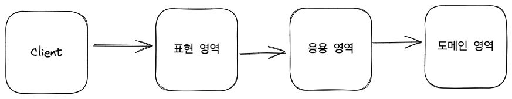

# 6.1 표현 영역과 응용 영역

사용자에게 기능을 제공하려면 도메인과 사용자를 연결해 줄 표현 영역과 응용 영역이 필요하다

**표현 영역**은 사용자의 요청을 해석한다. URL, 요청 파라미터, 쿠키, 헤더 등을 이용해서 사용자가 실행하고 싶은 기능을 판별하고 그 기능을 제공하는 응용 서비스를 실행한다.

```java
@PostMapping("/member/join")
public ModelAndView join(HttpServletRequest request) {
    String email = request.getParameter("email");
    String password = request.getParameter("password");

    // 응용 서비스에서 사용할 수 있게 사용자의 요청 값을 변환
    JoinRequest joinReq = new JoinRequest(email, password);
    joinService.join(joinReq);

    ...
}
```
**응용 서비스**는 사용자가 원하는 기능을 제공한다. 사용자가 회원가입을 요청했다면 실제 그 요청을 위한 기능을 제공하는 주체는 응용 서비스에 해당한다.
응용 서비스의 메서드가 요구하는 파라미터와 표현 영역이 사용자로부터 전달받은 데이터는 형식이 일치하지 않기 때문에 표현 영역은 응용 서비스가 처리할 수 있는 형식으로 사용자 요청값을 변환해서 전달해야 한다.

사용자와의 상호 작용은 표현 영역이 담당하기 때문에 응용 서비스는 표현 영역에 의존하지 않는다. REST API로 호출하였는지, TCP 소켓을 사용하였는지는 응용 서비스의 관심사가 아니다. 단지 기능 실행에 필요한 입력 값을 받고 실행 결과만 리턴하면 된다.

# 6.2 응용 서비스의 역할
 - 응용 서비스는 사용자(클라이언트)가 요청한 기능을 실행
 - 표현 영역 입장에서 응용 서비스는 도메인 영역과 표현 영역을 연결하는 창구 역할
 - 도메인 객체 간의 흐름을 제어
 - 트랜잭션 처리
 - 접근 제어와 이벤트(나중에 살펴봄)

```java
public Result doSomeFunc(SomeReq req) {
    // 1. 리포지터리에서 애그리거트 구하기
    SomeAgg agg = someAggRepository.findById(reg.getId());
    checkNull(agg);

    // 2. 애그리거트 도메인 기능 실행
    agg.doFunc(reg.getValue());

    // 3. 결과 리턴
    return createSuccessResult(agg);
}

public Result doSomeCreation(CreateSomeReq req) {
    // 1. 유효성 검사
    // 데이터가 중복인지? 유효성 검사에 의해 넘어온 데이터가 유효한지?
    validate(req);

    // 2. 애그리거트 생성
    SomeAgg newAgg = createSome(req);

    // 3. 영속화
    someAggRepository.save(newAgg);

    // 4. 결과 리턴
    return createSuccessResult(newAgg);
}
```

## 6.2.1 도메인 로직 넣지 않기
응용 서비스가 복잡하다면 응용 서비스에서 도메인 로직을 구현했을 가능성이 크다. 응용 서비스에서 도메인 로직을 구현하면 **코드 중복**, **로직 분산** 등 코드 품질에 안좋은 영향을 줄 수 있다.

```java
public class ChangePasswordService {

    public void changePassword(String memberId, String oldPw, String newPw) {
        Member member = memberRepository.findById(memberId);
        checkMemberExists(member);

        // Member 도메인 로직 시작
        if (!passwordEncodier.matches(oldPw, member.getPassword())) {
            throw new BadPasswordException();
        }
        // Member 도메인 로직 끝

        member.setPassword(newPw);
    }
}

public class DeactivationService {

    public void deactivate(String memberId, String pwd) {
        Member member = memberRepository.findById(memberId);
        checkMemberExists(member);

        // Member 도메인 로직 시작
        if (!passwordEncodier.matches(oldPw, member.getPassword())) {
            throw new BadPasswordException();
        }
        // Member 도메인 로직 끝

        member.deactivate();
    }
}
```
도메인 로직이 응용 서비스에 분산해서 구현되어 있으면 코드 품질에 문제가 생기게 된다.

첫번째 문제는 코드의 응집성이 떨어진다. 도메인 로직이 서로 다른 영역에 위치한다는 것은 도메인 로직을 파악하기 위해 여러 영역을 분석해야 한다는 것을 의미한다.

두번째 문제는 여러 응용 서비스에서 동일한 도메인 로직을 구현하게 되어 중복이 발생한다는 것이다. 도메인 영역에 도메인 로직을 구현하면 응용 서비스는 그 기능을 사용하기만 하면 된다.

결과적으로 두 가지 문제로 인해 변경이 어려워 지게 되고 변경 용이성을 갖기 위해 도메인 로직을 도메인 영역에 작성하여 코드 중복을 줄이고 응집도를 높여야 한다.

# 6.3 응용 서비스의 구현
응용 서비스는 표현 영역과 도메인 영역을 연결하는 창구(Facade) 역할을 한다.
응용 서비스를 구현할 때 몇가지 고려할 사항에 대해서 알아본다.

## 6.3.1 응용 서비스의 크기
보통 다음의 두가지 방법 중 한 가지 방식으로 응용 서비스를 구현한다.
 - 한 응용 서비스 클래스에 도메인 기능 모두 구현하기
 - 구분되는 기능별로 응용 서비스 클래스를 따로 구현하기

### 1. 한 응용 서비스 클래스에 도메인 기능 모두 구현하기
한 도메인과 관련된 기능을 구현한 코드가 한 클래스에 있기 때문에 동일 로직에 대한 중복을 제거할 수 있다는 장점이 있다.
```java
public class MemberService {

    private MemberRepository memberRepository;
    private Notifier notifier;

    public void changePassword(String memberId, String currentPw, String newPw) {
        Member member = findExistingMember(memberId);
        member.changePassword(currentPw, newPw);
    }

    public void initializePassword(String memberId) {
        Member member = findExistingMember(memberId);
        String newPassword = member.initializePassword();
        notifier.notifyNewPassword(member, newPassword);
    }

    public void leave(String memberId, String curPw) {
        Member member = findExistingMember(memberId);
        member.leave();
    }

    // 각 기능의 동일 로직에 대한 구현 코드 중복을 쉽게 제거
    private Member findExistingMember(String memberId) {
        Member member = memberRepository.findById(memberId);
        if (member == null) {
            throw new NoMemberException(memberId);
        }
        return member;
    }

    ...
    // 클래스의 크기가 커진다는 단점
}
```
하지만 한 서비스 클래스의 크기(코드 줄 수)가 커진다는 것은 이 방식의 단점이다.
코드 크기가 커지면 연관성이 적은 코드가 한 클래스에 함께 위치할 가능성이 높아지게 되는데 결과적으로 관련 없는 코드가 뒤섞여 코드를 이해하는데 어렵게 하고 코드 품질을 낮추는 결과를 초래한다.

### 2. 구분되는 기능별로 응용 서비스 클래스를 따로 구현하기
이 방식은 한 응용 서비스 클래스에서 1개 혹은 2 ~ 3개의 기능을 구현한다.
이 방식을 사용하면 클래스 개수는 많아지지만 한 클래스에 관련된 기능을 모두 구현하는 것과 비교해서 코드 품질을 일정 수준으로 유지하는데 도움이 된다. 또한 각 클래스별로 필요한 의존 객체만 포함하므로 다른 기능을 구현한 코드에 영향을 받지 않는다.

```java
public class ChangePasswordService {
    private MemberRepository memberRepository;

    public void changePassword(String memberId, String curPw, String newPw) {
        Member member = memberRepository.findById(memberId);
        if (member == null) {
            throw new NoMemberException(memberId);
        }

        member.changePassword(curPw, newPw);
    }

    ...
}
```
각 기능마다 동일한 로직을 구현할 경우 별도 클래스(ex. Helper 클래스)에 로직을 구현해서 코드가 중복되는 것을 방지할 수 있다.

## 6.3.2 응용 서비스의 인터페이스와 클래스
응용 서비스를 구현할 때 논쟁이 될 만한 것이 인터페이스가 필요한 지이다.
우선 인터페이스가 필요한 몇 가지 상황이 있는데 
 - 구현 클래스가 다수 존재하는 경우
 - 런타임에 구현 객체를 교체해야 하는 경우

이러한 경우일 때 인터페이스를 유용하게 사용할 수 있다. 그런데 응용 서비스는 런타임에 교체하는 경우가 거의 없고 하나 응용 서비스의 구현 클래스가 두 개인 경우도 드물다.

이러한 이유로 인터페이스와 클래스를 따로 구현하면 소스 파일만 많아지고 구현 클래스에 대한 간접 참조가 증가해서 전체 구조가 복잡해 진다.

>*TDD를 하는 경우에는?*

### TDD. 표현 영역 먼저 개발을 시작한다면
예를 들어 스프링 MVC의 경우 컨트롤러를 TDD로 먼저 개발한다면 컨트롤러에서 사용할 응용 서비스의 구현체가 없으므로 응용 서비스의 인터페이스를 이용해서 컨트롤러의 구현을 완성해 갈 수 있다.

### TDD. 도메인 영역, 웅용 서비스 먼저 개발을 시작 한다면
도메인 영역이나 응용 서비스 먼저 개발한다면 표현 영역의 단위 테스트를 위해 응용 서비스 클래스의 가짜 객체가 필요한데 이를 위해 인터페이스를 추가할 수도 있다. 하지만 Mockito와 같은 테스트 도구를 이용하여 테스트용 대역 객체를 만들 수 있기 때문에 응용 서비스에 대한 인터페이스 없이도 표현 영역을 테스트할 수 있다.

## 6.3.3 메서드 파라미터와 값 리턴
응용 서비스가 제공하는 메서드는 도메인을 이용해서 사용자가 요구한 기능을 실행하는 데 필요한 값을 파라미터로 전달 받아야 한다. 스프링 MVC의 경우 요청 파라미터를 자바 객체로 변환하는 기능을 제공하므로 응용 서비스에 전달할 요청 파라미터가 두 개 이상 존재하면 데이터 전달을 위한 별도 클래스를 사용하는 것이 편리하다.
```java
@Controller
@RequestMapping("/member/changePassword")
public class MemberPasswordController {

    // 클래스를 이용해서 응용 서비스에 데이터를 전달하면
    // 프레임워크가 제공하는 기능을 활용하기에 좋음
    @PostMapping
    public String submit(ChangePasswordRequest changePwdReq) {
        Authentication auth = SecurityContext.getAuthentication();
        changePwdReq.setMemberId(auth.getId());
        try {
            changePasswordService.changePassword(changePwdReq);
        } catch (NoMemberException ex) {
            // 예외 처리 및 응답
        }
    }
}
```

응용 서비스의 결과를 표현 영역에서 사용해야 하면 응용 서비스의 메서드의 결과로 필요한 데이터를 리턴한다. 대표적인 예로 식별자다.
```java
public class OrderService {

    @Transactional
    public OrderNo placeOrder(OrderRequest orderRequest) {
        OrderNo orderNo = orderRepository.nextId();
        Order order = createOrder(orderNo, orderRequest);
        orderRepository.save(order);
        // 응용 서비스 실행 후 표현 영역에서 필요한 값 리턴
        return orderNo;
    }
}
```
주문 후 주문 상세 내역을 볼 수 있는 링크를 제공하기 위해 OrderNo(주문번호)를 결과로 리턴한다.
스프링 MVC를 사용한 코드에서는 다음과 같이 뷰 코드에서 링크를 생성하는데 사용한다.
```java
@Controller
public class OrderController {

    @PostMapping("/order/place")
    public String order(OrderRequest orderReq, ModelMap model) {
        setOrder(orderReq);
        OrderNo orderNo = orderService.placeOrder(orderReq);
        modelMap.setAttribute("orderNo", orderNo.toString());
        return "order/success";
    }
}
```

응용 서비스에서 애그리거트 자체를 리턴할 수도 있다.
```java
@Controller
public class OrderController {

    @PostMapping("/order/place")
    public String order(OrderRequest orderReq, ModelMap model) {
        setOrder(orderReq);
        Order order = orderService.placeOrder(orderReq);
        modelMap.setAttribute("order", order);
        return "order/success";
    }

    // 뷰 코드
    <a th:href="@{/orders/my/{ordNo}/(orderNo=${order.number})}">주문 내용 보기</a>
}
```
이것은 도메인의 로직 실행을 응용 서비스와 표현 영역 두 곳에서 할 수 있게 되고 기능 실행 로직을 응용 서비스와 표현 영역에 분산시켜 코드의 응집도를 낮추는 원인이 된다.

응용 서비스는 표현 영역에서 필요한 데이터만 리턴하는 것이 코드의 응집도를 높이는 확실한 방법이다.

## 6.3.4 표현 영역에 의존하지 않기
응용 서비스의 파라미터 타입을 결정할 때 주의할 점은 표현 영역과 관련된 타입을 사용하면 안된다는 점이다.

다음과 같이 표현 영역애서 HttpServletRequest 를 응용 서비스에 전달하면 안 된다.
응용 서비스에서 표현 영역을 의존하면 다음과 같은 문제가 발생한다.
 - 응용 서비스를 단독으로 테스트하기 어려움
 - 표현 영역의 구현이 변경되면 응용 서비스의 구현도 함께 변경됨
 - 응용 서비스가 표현 영역의 역할을 대신하는 상황이 생김
```java
public class AuthenticationService {

    public void authenticate(HttpServletRequest request) {
        String id = request.getParameter("id");
        String password = request.getParameter("password");
        if (checkIdPasswordMatching(id, password)) {
            // 응용 서비스에서 표현 영역의 상태 처리
            HttpSession session = request.getSession();
            session.setAttribute("auth", new Authentication(id));
        }
    }
}
```
세션의 경우 표현 영역의 상태에 해당하는데 이 상태를 응용 서비스에서 변경하고 있다. 이렇게 되면 표현 영역의 코드만으로 표현 영역의 상태가 어떻게 변경되는지 추적하기 어려워 져서 **표현 영역의 응집도가 깨지게 되고 결과적으로 코드 유지 보수 비용이 증가하는 원인이 된다.**

표현 영역의 응집도를 지키고, 유지 보수 비용이 증가하지 않게 하려면 응용 서비스가 표현 영역의 기술을 의존하지 않아야 한다. 이를 지키기 위한 가장 쉬운 방법으로 서비스 메서드 파라미터와 리턴 타입으로 표현 영역의 구현 기술을 사용하지 않는 것이다.

## 6.3.5 트랜잭션 처리
응용 서비스의 중요한 역할 중 하나가 트랜잭션 관리이다.
스프링에서 제공하는 트랜잭션 관리 기능을 이용하면 쉽게 트랜잭션 처리를 할 수 있다.
```java
public class ChangePasswordService {

    @Transactional
    public void changePassword(ChangePasswordRequest request) {
        Member member = findExistingMember(request.getMemberId());
        member.changePassword(request.getCurrentPassword(), request.getNewPassword());
    }
}
```
프레임워크가 제공하는 규칙을 따르면 간단한 설정만으로 트랜잭션을 시작하여 커밋하고 익셉션이 발생하면 Rollback 할 수 있다.

# 6.4 표현 영역

# 6.5 값 검증

# 6.6 권한 검사

# 6.7 조회 전용 기능과 응용 서비스