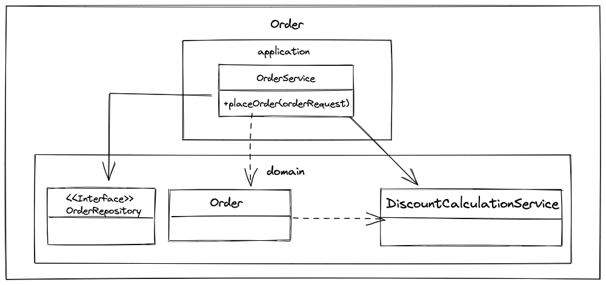
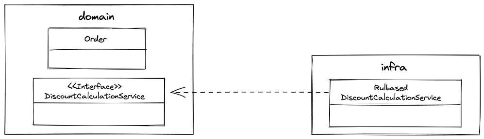

# 7.1 여러 애그리거트가 필요한 기능
도메인 영역의 코드를 작성하다 보면 한 애그리거트로 기능을 구현할 수 없을 때가 있다.

결제 금액 로직을 예로 들었을때
 - 상품 
 - 주문
 - 할인 쿠폰
 - 회원

4개의 애그리거트가 관여하는데 실제 결제 금액을 계산해야 하는 주체는 어떤 애그리거트일까?

만약 주문 애그리거트가 실제 결제 금액을 계산하는 주체가 된다면
```java
public class Order {
    ...
    private Orderer orderer;
    private List<OrderLine> orderLines;
    private List<Coupon> usedCoupons;

    private Money calculatePayAmounts() {
        Money totalAmounts = calculateTotalAmounts();

        // 1. 쿠폰별 할인 금액 구하기
        Money discount = coupons.stream()
                                .map(coupon -> calculateDiscount(coupon))
                                .reduce(Money(0), (v1, v2) -> v1.add(v2));

        // 2. 회원에 등급에 따라 추가 할인을 구한다.
        Money membershipDiscount = calculateDiscount(orderer.getMember().getGrade());

        // 3. 실제 결제 금액 계산
        return totalAmounts.minus(discount).minus(membershipDiscount);
    }

    private Money calculateDiscount(Coupon coupon) {
        // orderLines의 각 상품에 대해 쿠폰을 적용해서 할인 금액 계산하는 로직
        // 쿠폰의 적용 조건 등을 확인하는 코드
        // 정책에 따라 복잡한 if-else와 계산 코드
    }

    private Money calculateDiscount(MemberGrage grade) {
        // 등급에 따라 할인 금액 계산
    }

}
```
이 코드에서 할인 정책은 주문 애그리거트가 갖고 있는 구성요소와 관련이 없음에도 결제 금액 계산의 책임이 주문 애그리거트에 있기 때문에 주문 애그리거트의 코드를 수정해야 한다.

이렇게 한 애그리거트에 넣기 애매한 도메인 기능을 억지로 지정한 애그리거트에 넣게 되면 그 애그리거트는
 - 자신의 책임 범위를 넘어서는 기능을 구현하게 된다.
 - 외부에 대한 의존이 높아지게 되며 코드의 복잡도가 증가하여 수정하기 어려운 코드가 된다.
 - 애그리거트의 범위를 넘어서는 도메인 개념이 숨어들어 명시적으로 드러나지 않게 된다.

**이런 문제를 해소하는 방법 중 하나가 도메인 기능을 별도의 서비스로 구현하는 것이다.(도메인 서비스)**

# 7.2 도메인 서비스
도메인 서비스는 도메인 영역에 위치한 도메인 로직을 표현할 때 사용한다.
 - 여러 애그리거트가 필요한 로직이거나, 한 애그리거트에 넣기에는 복잡한 로직(ex. 계산 로직)
 - 기능을 구현하기 위해 외부 시스템과 연동이 필요한 도메인 로직

## 7.2.1 계산 로직과 도메인 서비스
할인 금액 규칙 계산 처럼 한 애그리거트에 넣기 애매한 도메인 개념을 구현하려면 한 애그리거트에 넣기 보다는 도메인 서비스를 이용해서 도메인 개념을 명시적으로 드러내면 된다.

도메인 영역의 애그리거트나 밸류와 같은 구성요소와 도메인 서비스의 차이점은
 - 도메인 서비스는 상태 없이 로직만 구현한다.
 - 도메인 서비스를 구현하는 데 필요한 상태는 다른 방법으로 전달 받는다.

도메인 서비스는 도메인의 의미가 드러나는 용어를 타입과 메서드 이름으로 갖는다.
```java
public class DiscountCalculationService {

    public Money calculateDiscountAmounts(
        List<OrderLine> orderLines,
        List<Coupon> coupons,
        MemberGrade grade) {
            Money couponDiscount = coupons.stream()
                                .map(coupon -> calculateDiscount(coupon))
                                .reduce(Money(0), (v1, v2) -> v1.add(v2));
            
            Money membershipDiscount = calculateDiscount(orderer.getMember().getGrade());

            return couponDiscount.add(membershipDiscount);
        }

    private Money calculateDiscount(Coupon coupon) {
        ...
    }

    private Money calculateDiscount(MemberGrade grade) {
        ...
    }
}
```
DiscountCalculationService(도메인 서비스)를 사용하는 주체는 애그리거트가 될 수도 있고 응용 서비스가 될 수도 있다.

```java
// 애그리거트
public class Order {
    
    public void calculateAmounts(DiscountCalculationService discountCalculationService, MemberGrade grade) {
        Money totalAmounts = getTotalAmounts();
        Money discountAmounts = discountCalculationService.calculateDiscountAmounts(this.orderLines, this.coupons, grade);
        this.paymentAmounts = totalAmounts.minus(discountAmounts);
    }
    ...
}

// 응용 서비스
public class OrderService {
    private DiscountCalculationService discountCalculationService;

    @Transactional
    public OrdeNo placeOrder(OrderRequest orderRequest) {
        OrderNo orderNo = orderRepository.nextId();
        Order order = createOrder(orderNo, orderRequest);
        orderRepository.save(order);

        return orderNo;
    }

    private Order createOrder(OrderNo orderNo, OrderRequest orderRequest) {
        Member member = findMember(orderRequest.getOrdererId());
        Order order = new Order(orderNo, orderRequest.getOrderLines(),
                orderRequest.getCoupons(), createOrderer(member),
                orderRequest.getShippingInfo());
        order.calculateAmounts(this.discountCalculationService, member.getGrade());

        return order;
    }
}
```

> *도메인 서비스 객체를 애그리거트에 주입하지 않기*
 - 의존 주입을 위해 애그리거트에서 도메인 서비스에 대한 참조를 갖는 것은 도메인 서비스에 의존한다는 것을 의미한다.

 **도메인 객체는 필드(프로퍼티)로 데이터와 메서드를 이용해서 개념적으로 하나인 모델을 표현한다.** 도메인 서비스(위의 코드에서 DiscountCalculationService)는 데이터 자체와는 관련이 없고 도메인 객체를 DB에 보관할 때 다른 필드와 달리 저장할 필요가 없다면 도메인 서비스 객체를 애그리거트에 의존 주입할 필요는 없다.

 또한 애그리거트에서 제공하는 모든 기능에서 도메인 서비스 객체를 필요로 하는 것은 아니기 때문에 도메인 서비스 객체에 대한 참조를 필드로 추가하는 것은 좋은 방법이 아니다.

 ```java
 // 도메인 서비스
 public class TransferService {

    // 계좌 이체 기능 
    public void transfer(Account fromAcc, Account toAcc, Money amounts) {
        fromAcc.withDraw(amounts);
        toAcc.credit(amounts);
    }
 }

 // 응용 서비스
 public class AccountService {

    private TransferService transferService;

    private AccountRepository accountRepository;

    @Transactional
    public void transfer(TransferRequest transferRequest) {
        Account fromAcc = accountRepository.findById(transferRequest.getFromAccId());
        Account toAcc = accountRepository.findById(transferRequest.getToAccId());
        Money amounts = transferRequest.getAmounts();

        transferService.transfer(fromAcc, toAcc, amounts);
    }
 }
 ```
 애그리거트 메서드를 실행할 때 도메인 서비스를 인자로 전달하지 않고 반대로 도메인 서비스의 기능을 실행할 때 애그리거트를 전달하기도 한다. 이런식으로 동작하는 것 중 하나가 계좌 이체 기능이다.
  - 계좌 이체는 두 계좌 애그리거트가 관여한다.
  - 한 애그리거트는 출금을 하고 나머지 애그리거트는 입금을 한다.

이를 구현한 도메인 서비스가 TransferService이고 도메인 서비스를 사용하는 응용 서비스는 AccountService가 된다. AccountService는 도메인 서비스를 이용해서 계좌 이체 도메인 기능을 실행하고 트랜잭션 처리는 응용 서비스인 자신이 처리한다.

>*특정 기능이 응용 서비스인지 도메인 서비스인지 구분하기 어려울 때는 해당 로직이 애그리거트의 상태를 변경하거나 애그리거트의 상태 값을 계산하는지 검사해 보면 된다.*

## 7.2.2 기능을 구현하기 위해 외부 시스템과 연동이 필요한 도메인 로직
외부 시스템이나 타 도메인과의 연동 기능도 도메인 서비스가 될 수 있다. 예를 들어 설문 조사 시스템과 사용자 역할 관리 시스템이 분리되어 있다고 하자.
 - 설문 조사 시스템은 설문 조사를 생성할 때 사용자가 생성 권한을 가진 역할인지 확인한다.
 - 그러기 위해서 설문 조사 시스템은 사용자 역할 관리 시스템과 연동해야 한다.
 - 설문 조사 도메인에서 사용자가 설문 조사 생성 권한을 가졌는지 확인할 수 있다.

```java
public class CreateSurveyService {
    private SurveyPermissionChecker permissionChecker;

    public Long createSurvey(CreateSurveyRequest req) {
        validate(req);

        // 도메인 서비스를 이용해서 외부 시스템 연동을 표현
        if (!permissionChecker.hasUserCreationPermission(req.getRequestorId())) {
            throw new NoPermissionException();
        }
    }
}

// 도메인 로직 관점에서 인터페이스를 작성
// 구현 클래스는 infra 영역에 위치
public interface SurveyPermissionChecker {
    boolean hasUserCreationPermission(String userId);
} 
```

## 7.2.3 도메인 서비스의 패키지 위치
도메인 서비스는 도메인 로직을 표현하므로 도메인 서비스의 위치는 다른 도메인 구성요소와 동일한 패키지에 위치한다.


엔티티, 밸류와 같은 다른 구성요소와 명시적으로 구분하고 싶다면 domain 패키지 밑에 domain.model, domain.service, domain.repository와 같이 하위 패키지를 구분하여 위치시켜도 된다.

## 7.2.4 도메인 서비스의 인터페이스와 클래스

*도메인 서비스의 구현이 특정 기술에 종속되면 인터페이스와 구현 클래스로 분리한다.*

도메인 서비스의 로직이 고정되어 있지 않은 경우 도메인 서비스를 인터페이스로 구현하고 이를 구현한 클래스를 둘 수도 있다. 특히 외부 시스템을 이용해서 구현한다면 인터페이스는 도메인 영역에, 구현체는 인프라 영역에 위치한다.

 - 도메인 서비스의 구현이 특정 구현 기술에 의존하거나 외부 시스템의 API를 실행한다면 도메인 영역의 도메인 서비스는 인터페이스로 추상화해야 한다.
 - 이를 통해 도메인 영역이 특정 구현에 종속되는 것을 방지할 수 있고 도메인 영역에 대한 테스트가 쉬워진다.