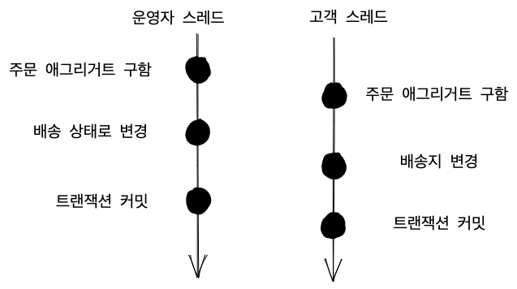
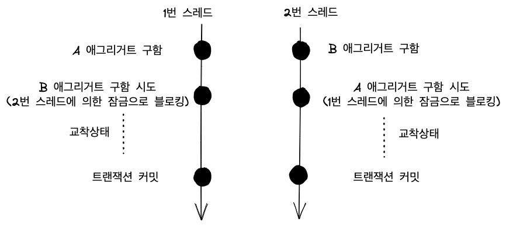

# 8.1 애그리거트와 트랜잭션


## 도메인 규칙
 - 주문의 상태가 배송이라면 고객은 배송지를 변경 할 수 없다.

이 그림은 운영자와 고객이 동시에 하나의 주문 애그리거트를 수정하는 과정을 보여준다. 트랜잭션마다 새로운 애그리거트를 생성하기 때문에 운영자 스레드에서 얻은 애그리거트, 고객 스레드에서 얻은 애그리거트는 물리적으로 서로 다른 애그리거트 객체를 사용한다.

그렇기 때문에 운영자 스레드에서 얻어낸 주문 애그리거트의 상태를 배송으로 변경하더라도 고객 스레드에서 사용하는 주문 애그리거트 객체에는 영향을 주지 않는다.

운영자 스레드에서 트랜잭션을 커밋하지 않기 때문에 고객 스레드에서는 주문의 상태를 변경 할 수 있다.

문제점은 애그리거트의 일관성이 깨지는 것이다.
 - 운영자 입장에서는 기존 배송지 정보를 이용해서 주문의 상태를 배송으로 변경
 - 고객 입장에서는 커밋 전 배송의 상태를 보고 배송지를 변경

일관성이 깨지는 문제가 발생하지 않게 하려면 다음 두 가지 중 하나를 해야한다.
 - 운영자가 배송지 정보를 조회하고 상태를 변경하는 동안 고객은 애그리거트를 수정하지 못하게 막는 방법
 - 운영자가 배송지 정보를 조회한 이후에 고객이 정보를 변경하면 운영자는 애그리거트를 다시 조회한 뒤 수정하는 방법

이 두 가지 방법은 애그리거트 자체의 트랜잭션과 관련이 있고 대표적인 트랜잭션 처리 방식에 대해서 알아본다.
 - 선점 잠금(Pessimistic Lock)
 - 비선점 잠금(Optimistic Lock)

# 8.2 선점 잠금(Pessimistic Lock)
선점 잠금은 먼저 애그리거트를 구한 스레드가 애그리거트 사용이 끝날 때까지 다른 스레드는 해당 애그리거트를 수정하지 못하게 하는 방식이다.

선점 잠금은 보통 DBMS가 제공하는 행단위 잠금을 사용하여 구현한다. 예를들어
```sql
SELECT seat movie where movice_enum = 4 FOR UPDATE
```
와 같은 쿼리를 이용하여 특정 레코드에 한 커넥션만 접근하게 하는 장치를 제공한다.


 1. 운영자 스레드가 애그리거트를 조회.
 2. 고객 스레드가 애그리거트 조회하였지만 운영자 스레드가 먼저 조회를 하였기 때문에 운영자 스레드가 잠금을 해제할 때 까지 대기한다.
 3. 운영자 스레드에서 트랜잭션 커밋을 하였고 잠금을 해제 한다.
 4. 대기 하고 있던 고객 스레드는 애그리거트를 조회 한다.

운영자 스레드가 커밋한 뒤에 애그리거트를 조회하기 때문에 고객 스레드는 운영자 스레드가 수정한 내용을 보게 된다.
선점 잠금을 사용하면 한 스레드가 애그리거트를 조회하고 수정하는 동안 다른 스레드는 블로킹 되기 때문에 동시에 애그리거트를 수정할 때 발생하는 일관성이 깨지는 문제를 해소할 수 있다.

# 8.2.1 선점 잠금과 교착 상태
선점 잠금을 사용할 때는 잠금 순서에 따른 **교착 상태**가 발생하지 않도록 주의해야 한다.

다음과 같은 상황이 있다고 가정해 보기로 한다.


1. 1번 스레드에서 A 애그리거트를 조회하여 선점 잠금을 구한다.
2. 2번 스레드에서도 B 애그리거트를 조회하여 선점 잠금을 구한다.
3. 1번 스레드에서 B 애그리거트 조회 시도 하였지만 2번에 의해서 잠금으로 블로킹(잠금 시도)
4. 2번 스레드에서도 A 애그리거트 조회 시도 하였지만 1번 스레드에 의해서 잠금으로 블로킹(잠금 시도)

이렇게 두 스레드는 각각 서로 필요한 애그리거트가 잠금되어 블로킹이 발생하여 결국에는 **교착 상태**에 빠진다.

최대 대기 시간을 지정하여 교착 상태가 지속되지 않도록 할 수 있다.
```java
// JPA에서 잠금을 구하는 대기 시간 지정
Map<String, Object> hints = new HashMap<>();
hints.put("javax.persistence.lock.timeout", 2000);
Order order = entityManager.find(Order.class, orderNo, LOckModeType.PESSIMISTIC_WRITE, hints);

// 스프링 데이터 JPA의 경우 @QueryHints 사용
public interface MemberRepository extends Repository<Member, MemberId> {
    @Lock(LockModeType.PESSIMISTIC_WRITE)
    @QueryHints({
        @QueryHint(name = "javax.persistence.lock.timeout", value = "2000")
    })
    @Query("select m from Member m where m.id = :id")
    Optional<Member> findByIdForUpdate(@Param("id") MemberId memberId);
}
```
지정한 잠금을 구하는 대기 시간이 지나면 익셉션을 발생시켜 교착 상태를 피할 수 있지만. DBMS에 따라 힌트가 적용되지 않을 수 있기 때문에 사용하고 있는 DBMS가 관련 기능을 지원하는지 확인이 필요하다.

# 8.3 비선점 잠금(Optimistic Lock)