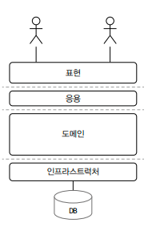
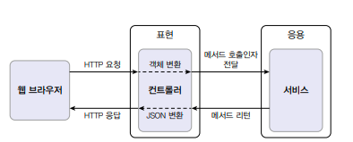
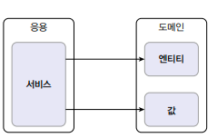
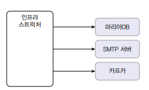

## 2.1 4개의 영역
- 표현, 응용, 도메인, 인프라스트럭쳐는 아키텍처를 설계할 때 출현하는 전형적인 구조이다.  


### 표현 계층
- 사용자의 요청을 받아 응용 영역에 전달한다. 그리고 응용 계층에 처리한 결과를 사용자에게 전달합니다.  


### 응용 계층
- 사용자에게 제공할 기능을 구현. 주문 등록, 주문 취소, 상품 상세 조회 같은 기능을 구현한다. 응용 영역에서 기능을 구현하기위해서는 도메인 모델을 사용하여 정의한다.
- 응용 서비스의 로직을 직접 수행한다기보다는 도메인 모델에 로직수행을 위임하여 처리한다.  


### 인프라스트럭처 계층
- 구현 기술에 대한 것을 다룬다. RDMS 연동을 처리하거나 메시징 큐에 메시지를 전송하거나 수신하는 기능을 구현
- 몽고디비나 레디스의 데이터 연동을 구현하기도함.
- 논리적인 개념보다는 실제 구현을 다룬다.


### 2.2 계층구조 아키텍처
- 계층 구조는 특성상 상위계층에서 하위 계층으로의 의존만 존재한다. 하위 계층이 상위 계층을 의존하지 않는다.
- 구조를 엄격하게 하여 아래 계층에만 의존하도록 하지만 상황에 따라 유연하게 적용하기도 한다.

- 위 그림처럼 더 아래 계층에 의존한 구조로 가져가기도 한다. 
- 주의점은 표현, 응용, 도메인 계층이 상세한 구현 기술을 가진 인프라스트럭쳐 계층에 의존하게 된다.

```java
public class DroolsRuleEngine {
    private KieContainer kContainer;
    
    public DroolsRuleEngine() {
        KieService ks = KieServices.Factory.get();
        kContainer = ks.getKieContainer();
    }
    public void evalute(String sessionName, List<?> facts) {
        KieSession kieSession = kContainer.newSession(sessionName);
        
        try {
            facts.forEach(x->kieSession.insert(x));
            kieSession.fireAllRules();
        } finally {
            kieSession.dispose();
        }
    }
}
```

```java
public class CalculateDiscountService {
    private DroolsRuleEngine ruleEngine;
    
    public CalculateDiscountService() {
        ruleEngine = new DroolsRuleEngine();
    }
    
    public Money calculateDisCount(List<OrderLine> orderLines, String customerId) {
        Customer customer = findCustomer(customerId);
        
        MutableMoney money = new MutableMoney(0); // Drools에 특화된 코드(얀신 결과를 받기 위한 타입)
        List<?> facts = Arrays.asList(customer, money); // Drools에 특화된 코드(룰에 필요한 데이터)
        facts.addAll(orderLines);
        ruleEngine.evalute("discountCalculation",facts);// Drools에 특화된 코드(룰의 이름)
        
        return money.toImmutableMoney();
    }
}
```
- 세션 이름을 변경하면 코드도 변경해야한다.
- MutableMoney는 룰 적용 결과값을 위해 존재하는 타입이다.
- 겉으로는 의존하지 않지만 완전하게 의존하고 있다.
- 기능 확장의 어려움과 테스트의 어려움을 가지고 있다.

## 2.3  DIP
>프로그래머는 “추상화에 의존해야지, 구체화에 의존하면 안된다.”


- 고수준 모듈 : CalculateDiscountService
- 저수준 모듈 : DroolsRuleEngine 
- 여기서 CalculateDiscountService는 의미 있는 단일 기능을 제공하는 고수준 모듈이다
  고수준 모듈의 기능을 구현하려면 여러 하위 기능이 필요하다
- 고수준 모듈이 저수준 모듈을 사용하면 구현 변경과 테스트가 어려운 문제가 발생

### 비밀은 추상화된 인터페이스
```java 
public interface RuleDiscounter { 
    Money applyRules(Customer customer, List<OrderLine> orderLines);
}
```
- 추상화된 인터페이스에 의존한 서비스로직 
```java
public class CalculateDiscountService {
    private RuleDiscounter ruleDiscounter;

    public CalculateDiscountService(RuleDiscounter ruleDiscounter) {
        this.ruleDiscounter = ruleDiscounter;
    }

    public Money calculateDisCount(List<OrderLine> orderLines, String customerId) {
        Customer customer = findCustomer(customerId);

        return ruleDiscounter.applyRules(customer, orderLines);
    }
}
```
- 서비스레이어는 Drools에 의존하는 코드가 없어짐
- RuleDiscounter의 구현 객체는 생성자를 통해서 전달 받음

### DIP 적용
>고수준 모듈: 어떤 의미 있는 단일 기능을 제공하는 모듈  
>저수준 모듈: 고수준 모듈의 기능을 구현하기 위해 필요한 하위 기능의 실제 구현


- DIP는 이 문제를 해결하기 위해 저수준 모듈이 고수준 모듈에 의존하도록 바꾸며, 이는 추상화한 인터페이스를 통해 이루어진다
  - 고수준 모듈을 인터페이스로 추상화한다
  - 고수준 모듈은 이 인터페이스를 의존하고, 저수준 모듈은 이 인터페이스를 구현한다
  - 실제 사용할 저수준 모듈은 의존 주입을 통해서 전달 받는다
  - 이미지 반대로 되어 있다.
### 정리
- 저수준 모듈이 고수준 모듈에 의존한다고 해서 DIP(Dependency Inversion Principle), 의존역전 원칙이라고 부른다
- 의존성이 역전됨에 따라 어려움을 해결할 수 있다
- (컴파일 타임에) 고수준 모듈은 실제 구현체가 어떤 것인지 모른 채 주입받는다

```java
// 1. 사용할 저수준 객체 생성 (RuleDiscounter는 인터페이스)
RuleDiscounter ruleDiscounter = new DroolsRuleDiscounter();

// 2. 생성자 방식으로 주입
CalculateDiscountService disService = new CalculateDisocuntService(ruleDiscounter);

// 3. 사용할 저수준 구현 객체 변경
RuleDiscounter ruleDiscounter = new SimpleRuleDiscounter();

// 4. 사용할 저수준 모듈을 변경해도 고수준 모듈을 수정할 필요가 없음
CalculateDiscountService disService = new CalculateDisocuntService(ruleDiscounter);
```
테스트의 어려움 또한 해결할 수 있다
CustomerRepository와 RuleDicounter 등의 고수준의 인터페이스를 사용하면 대역 객체를 사용해서 테스트를 진행할 수 있다

### DIP 주의사항
- DIP를 적용할 때 하위 기능을 추상화한 인터페이스는 고수준 모듈 관점에서 도출한다
  - CalculateDiscountService에서는 어떤 인프라스트럭처를 이용해서 계산하는 것이 중요하지 않다.
  - 규칙에 따라 할인 금액을 계산한다는 것이 중요하다. 따라서 '할인 금액 계산'을 추상화한 인터페이스는 고수준 모듈에 위치한다


### DIP와 아키텍처
- 아키텍처의 관점으로 봤을 때에는 고수준의 모듈을 실제 구현하는 것은 인프라스트럭처이다.
- 응용계층, 도메인은 인프라스트럭처를 이용하여 기능을 제공하는 저수준 모듈이다.
- 이러한 아키텍처에서 DIP를 적용한다면 아래와 같이 구현하여 다른 구현 클래스로도 변경해도 다른 레이어에 지장없는 아키텍처를 구성할 수 있다.


## 